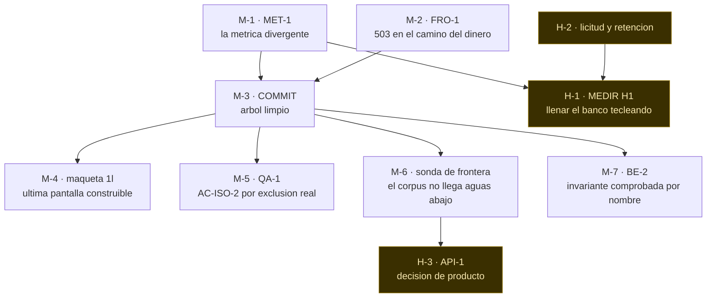

# METAS.md — el trabajo pendiente, en forma de meta

> **Qué es.** La lista de metas abiertas, cada una con **su condición de término
> expresada como comando**. Es el insumo de `/loop`: el comando lee el estado
> (`CLAUDE.md`, `STATE.md`, la cola de `LEDGER.md`) y **acá encuentra qué se
> considera terminado**.
>
> **Por qué no está dentro de `.claude/commands/loop.md`.** Ese archivo dice, con
> todas las letras, *«no vuelvas a escribir acá qué hallazgo sigue»*: un comando
> que embebe el estado se desfasa. Este archivo puede desfasarse igual —por eso
> cada meta se cierra con un comando y no con una opinión: **si el comando ya
> está verde, la meta está cumplida aunque siga escrita acá.**
>
> **Autoridad.** `LEDGER.md` manda sobre `STATE.md`, y `STATE.md` manda sobre
> este archivo. Ninguna meta autoriza nada que `CLAUDE.md` §1 prohíba.

**Escrito:** 2026-08-20 · **último commit:** `9ee0062` · árbol: **23 modificados,
8 sin rastrear**.

> **Todos los números de este archivo están LEÍDOS, no medidos hoy.** Salen del
> baseline del 2026-08-20 (`STATE.md`, *«Baseline medido hoy sobre el árbol SIN
> COMMITEAR»*) y de la regresión final del 2026-08-19 (`LEDGER.md`). **El primer
> acto de toda meta es volver a correr su comando**, porque el árbol cambió desde
> entonces y una cifra heredada publicada como actual ya costó un veto en este
> repo.

---

## 1. Forma obligatoria de una meta

Una meta que no tenga estas seis filas no es una meta: es un deseo.

| Fila | Qué exige |
|---|---|
| **Enunciado** | la propiedad, no la tarea. *«El guard distingue la métrica de H1 de otra resta»*, no *«tocar el guard»* |
| **Condición de término** | **un comando** y su salida esperada. Sin número congelado: el comando dice el número |
| **Estado leído** | de dónde sale lo que hoy se cree, con su fecha. Nunca presentado como medición de hoy |
| **Quién la cierra** | **concilio** (implementador → auditor → verificador) o **humano**. Un bloqueo humano no lo resuelve ningún fix |
| **Precedencia** | a qué bloquea y qué la bloquea |
| **No incluye** | el alcance que queda afuera, escrito, para que la meta no crezca sola |

Y dos reglas de cierre, que valen para todas:

- **Probada fallando.** Todo verificador que la meta toque se corre **con el
  fallo plantado**, y se pega la salida de las dos corridas. *Un gate que solo se
  probó contra un repo limpio no se probó.*
- **La lección se vuelve mecanismo.** El paso LEARN de `/loop` no es un relato:
  si la falla puede repetirse, la meta **no está cerrada hasta que exista el
  guard** que la vuelve imposible.

---

## 2. Precedencia



**M-1 antes que todo lo demás, y no por orden estético:** mientras MET-1 esté
vivo, `verificar:h1` falla con `CAUSA: metrica-divergente` en vez de fallar por
banco vacío — o sea que **la meta de fondo del proyecto no se puede ni empezar a
medir.**

---

## 3. Metas del concilio — las cierra `/loop`

### ~~M-1 · MET-1 · el guard de la métrica no distingue dominios~~ · **CERRADA 2026-08-20**

> **Cumplida.** `verificar:metrica` **5/5** y `verificar:h1` volvió a
> `CAUSA: banco-vacio`. Eran **dos** guards rotos —MET-1a en `metrica.mjs`,
> MET-1b en `verificar-h1.mjs`—, los dos por comparar formas distintas del mismo
> texto. Probada con tres fallos plantados. Evidencia: `LEDGER.md` (2026-08-20,
> noche). **No cierra AC-H1-2**, que sigue en **C-1**.
>
> Se conserva escrita, no se borra: una meta cerrada es lo que impide que alguien
> la reabra sin leer por qué se cerró.

| | |
|---|---|
| **Enunciado** | El guard de AC-H1-2 acepta una resta entre columnas de tiempo **de otro dominio** cuando está declarada con su motivo, y sigue rechazando cualquier resta publicada como métrica de H1 que no sea la de `spec.md` §6. **Sin debilitar la propiedad** |
| **Condición de término** | `npm run verificar:metrica` → PASS · **y** `npm run verificar:h1` vuelve a fallar **por banco vacío**, no por `CAUSA: metrica-divergente`. Las dos cosas, corridas, no supuestas |
| **Estado leído** | `verificar:metrica` **3/4 FAIL** (2026-08-20): `scripts/verificar-reportes.mjs` usa `salida_at - entrada_at` —permanencia media, legítima— y el guard la lee como métrica de H1 divergente. Regresión **introducida por el trabajo sin commitear** |
| **Quién la cierra** | concilio |
| **Precedencia** | bloquea a **M-3** y a **H-1**. No la bloquea nada |
| **No incluye** | reabrir AC-H1-2 (**C-1**): el criterio sigue **NO VERIFICADO** y esta meta no lo declara verificado |

**Primer acto:** revisar si el `implementador` que el reinicio se llevó dejó
cambios en el árbol (`STATE.md`, *«Trabajo en vuelo»*). Estaba en el enfoque
correcto —declarar el motivo, al estilo de los huérfanos de
`verificar-ac.mjs`—, **sin auditar y sin verificar**.

**Guard que esta meta debe dejar (paso LEARN, obligatorio).** La causa raíz no es
el guard: es que **la regresión publicada en el ledger del 19 lista 22
verificadores y `metrica` no está entre ellos**. *Una regresión que no se corre no
existe.* El mecanismo ya está a mano: `npm run evidencia` falla si un
`verificar:*` no está en `CATALOGO` ni declarado fuera. La meta incluye que
**el bloque de regresión del ledger se genere con ese comando y no se teclee**.

```
/loop M-1 de METAS.md: MET-1. Que el guard de la metrica distinga una resta de
otro dominio declarada con su motivo, sin debilitar la propiedad. Cierra cuando
verificar:metrica pasa Y verificar:h1 vuelve a fallar por banco vacio. Incluye el
guard de LEARN: el bloque de regresion se genera con npm run evidencia.
```

---

### M-2 · FRO-1 · un 5xx en el camino del dinero

| | |
|---|---|
| **Enunciado** | `POST /api/sesiones/[id]/salida` **no devuelve 5xx ante ninguna entrada degenerada, con ninguno de los tres roles**. Es AC-API-1 sobre la ruta que cobra |
| **Condición de término** | `npm run verificar:frontera` → 5/5, con el corpus completo y los tres roles · **y** el repro de los tres roles pegado en el ledger |
| **Estado leído** | **4/5 FAIL** (2026-08-20): 503 con byte NUL y con año fuera del rango de Postgres, dos veces cada uno. **Sin diagnosticar.** A mano, como `operador`, da **400** (`esIdValido` corta bien). El verificador entra con **tres** roles y cada caso falló **dos veces**: el 503 sale por los otros dos. Sospechoso declarado: el usuario `plataforma`, sembrado con `estacionamiento_id NULL` |
| **Quién la cierra** | concilio |
| **Precedencia** | bloquea a **M-3**. No la bloquea nada |
| **No incluye** | tocar `esRechazoDefinitivo` — eso es **H-3**, decisión de producto |

**Primer acto, y es una orden explícita de `STATE.md`: reproducirlo con los tres
roles antes de tocar nada.** El repro se reescribe con `import postgres` resuelto
desde el repo, **no desde `$TEMP`** (ahí falla con `ERR_MODULE_NOT_FOUND`).

**Dato que ordena la hipótesis:** el 19 esta misma comprobación daba **5/5** con
315 casos. El 4/5 apareció con el corpus y los roles nuevos: **es regresión de
sonda o defecto recién descubierto**, y saber cuál de las dos cambia la
corrección. Un 5xx acá no es cosmético — la cola local lo trata como recuperable
y **corta el lote del turno entero**: `esRechazoDefinitivo` solo trata 400 y 403
como definitivos (`src/lib/cola-local.ts:276`).

```
/loop M-2 de METAS.md: FRO-1. Reproducir primero con los tres roles el 503 de
POST /api/sesiones/[id]/salida (byte NUL y ano fuera de rango), despues corregir.
Cierra con verificar:frontera 5/5 y el repro de los tres roles en el ledger.
```

---

### M-3 · COMMIT · sacar el árbol del rojo

| | |
|---|---|
| **Enunciado** | El trabajo verificado de las sesiones del 19 y 20 está **commiteado**, en unidades coherentes, y el árbol queda limpio |
| **Condición de término** | regresión completa **en producción** (`npm run build ; npm start`) sin un solo FAIL sin explicar · `git status --short` vacío salvo lo que se decida no versionar |
| **Estado leído** | 23 modificados + 8 sin rastrear (tarifas, reportes, endurecimiento transversal, `frontera.test.ts`, `zona.ts`, y este archivo). **Son trabajo verificado de sesiones anteriores**, no de la actual |
| **Quién la cierra** | concilio |
| **Precedencia** | la bloquean **M-1** y **M-2**. Bloquea a M-4, M-5, M-6, M-7 |
| **No incluye** | ningún cambio de comportamiento: si algo hay que arreglar para que la regresión pase, **eso es otra meta** |

**Dos reglas de operación que ya costaron una corrida entera cada una:**

- **Los verificadores de navegador exigen producción.** Con `next dev`,
  `verificar:ui` da 12/21 y el fallo es del servidor, no del código.
- **Si el puerto 3000 quedó tomado**, `npm start` muere con `EADDRINUSE` y el
  `curl` de humo sigue dando 200 **desde el servidor viejo**. Matá el listener
  antes de creerle a un 200.

**Nada se commitea sobre rojo.**

```
/loop M-3 de METAS.md: commit. Regresion completa contra npm run build + npm start,
sin FAIL sin explicar, y commitear el trabajo verificado del 19 y 20 en unidades
coherentes. Sin cambios de comportamiento.
```

---

### M-4 · `1l` · la última pantalla construible

| | |
|---|---|
| **Enunciado** | La maqueta `1l` —ingreso del operador a pantalla completa— está construida **desde el lienzo**, sin inventar textos ni cifras, con su verificador |
| **Condición de término** | su verificador en verde **y probado con el fallo plantado** · declarado como **huérfano con su motivo** en `scripts/verificar-ac.mjs`, igual que `tarifas` y `reportes` |
| **Estado leído** | única pantalla construible que falta. `1e` y `1g` cerraron el 19 y el 20 |
| **Quién la cierra** | concilio, **con una parte que solo puede hacer el agente principal** |
| **Precedencia** | la bloquea **M-3** |
| **No incluye** | subir el AC a `spec.md` §9: haría exigible una maqueta, no una afirmación de §1–§8, y eso es autorar requisitos |

**El bloqueo técnico que hay que respetar, ya diagnosticado:** `DesignSync`
**no está disponible dentro de un subagente** —se buscó cuatro veces por
`ToolSearch`, ni por `select:` ni por palabras clave—. **La extracción del lienzo
la hace el agente principal**, guardando el `.dc.html` en el scratchpad y
recorriéndolo con grep/sed para no volcarlo entero en contexto. Proyecto
`964c3090-9776-4aa0-a79f-816b50244a83`, archivo `Plataforma Estacionamientos.dc.html`.

**Y el motivo por el que no se puede empezar sin eso:** lo único de `1l` que el
repo preservó son tres cadenas que ya están en `1b`. **Lo que `1l` agrega —el
teclado, el tamaño del campo, la jerarquía sin lista de permanencia— no está
escrito en ninguna parte del repo: sin el lienzo, construirlo es inventarlo.**

```
/loop M-4 de METAS.md: maqueta 1l. Extraer primero el lienzo con DesignSync desde
el agente principal (no funciona en subagente), y recien despues construir. Cierra
con su verificador probado con el fallo plantado y declarado como huerfano con su
motivo en verificar-ac.mjs.
```

---

### M-5 · QA-1 · AC-ISO-2 por exclusión de verdad

| | |
|---|---|
| **Enunciado** | La superficie de plataforma se descubre **por el rol que cada ruta declara**, no por la carpeta en que vive. Una ruta de plataforma fuera de `src/app/**/plataforma/` queda igual bajo el criterio |
| **Condición de término** | `npm run verificar:aislamiento` en verde **con una ruta de plataforma plantada fuera de la carpeta** que reparta patentes: **debe fallar** |
| **Estado leído** | **Discrepancia a resolver antes de trabajar.** El ledger del 19 lo da por cerrado (barrido por exclusión, `aislamiento` 9/9 → 12/12, probado con ruta plantada) y a la vez lo lista como *«sigue abierto»*; el orden acordado del 20 lo incluye entre los pendientes. **Correr el comando decide** |
| **Quién la cierra** | concilio |
| **Precedencia** | la bloquea **M-3** |
| **No incluye** | ampliar lo que `plataforma` puede ver: eso es SPEC-005 y es decisión de producto |

```
/loop M-5 de METAS.md: QA-1. Primero resolver la discrepancia corriendo
verificar:aislamiento con una ruta de plataforma plantada FUERA de la carpeta. Si
pasa igual, el barrido sigue siendo una enumeracion y hay que descubrir la
superficie por el rol declarado.
```

---

### M-6 · La sonda de `verificar:frontera` no llega aguas abajo

| | |
|---|---|
| **Enunciado** | El corpus de AC-API-1 alcanza las validaciones **posteriores a la primera guarda**. Hoy manda el mismo degenerado en todos los campos y `validarPatente` corta antes |
| **Condición de término** | el rediseño **propuesto con su costo** y, si se acepta, un corpus que **falle** al quitar una cota real aguas abajo. Medido: con la cota de fecha quitada, la sonda actual da **5/5 PASS igual** |
| **Estado leído** | hallazgo sobre la propia suite, registrado el 19. **API-2** —fecha fuera de rango → 503 en vez de 400— es su consecuencia: `verificar:frontera` daba PASS porque *su corpus no tiene fechas* |
| **Quién la cierra** | concilio **propone**; rediseñar la sonda es decisión, no ajuste |
| **Precedencia** | la bloquea **M-3**. Informa a **H-3** |
| **No incluye** | reescribir el verificador entero sin que la propuesta se acepte |

**Por qué esta meta vale más que un fix:** es el patrón que este repo persigue
—*un criterio que pasa sobre lo que no alcanza es un criterio que siempre pasa*—
aplicado a la suite misma.

```
/loop M-6 de METAS.md: la sonda de verificar:frontera no alcanza las validaciones
aguas abajo (medido: 5/5 PASS con la cota quitada). Proponer el rediseno del
corpus con su costo, probarlo quitando una cota real, y NO aplicarlo a ciegas.
```

---

### M-7 · BE-2 · una invariante comprobada por su nombre

| | |
|---|---|
| **Enunciado** | `verificar:invariantes` comprueba la **definición** de cada restricción contra el motor, no su nombre — y `pertenencia_por_rol` está en la lista |
| **Condición de término** | `npm run verificar:invariantes` en verde **y** fallando cuando se renombra o se debilita `pertenencia_por_rol` en la base |
| **Estado leído** | abierto. La invariante **sí funciona hoy** (`23514` en los dos sentidos); lo que falta es que el criterio la vigile |
| **Quién la cierra** | concilio |
| **Precedencia** | la bloquea **M-3** |
| **No incluye** | migraciones |

**Es la misma familia que M-6 y que AC-MEAS-1:** comprobar el nombre y no la
definición es otra forma de criterio que no puede fallar. Sin
`pertenencia_por_rol`, un `operador` sin estacionamiento filtraría contra `null`
y **las seis cláusulas de aislamiento del producto dejarían de aislar**.

```
/loop M-7 de METAS.md: BE-2. Que verificar:invariantes comprueba la definicion
contra el motor y no el nombre, e incluya pertenencia_por_rol. Probado renombrando
o debilitando la restriccion.
```

---

### ~~M-8 · SEG-2 · `X-Forwarded-For` sin salto de confianza~~ · **CERRADA 2026-08-20** (`5b14917`)

| | |
|---|---|
| **Enunciado** | El identificador de cliente del limitador de intentos **no se puede falsificar desde el cliente en producción** |
| **Condición de término** | **medición contra la URL viva**, no contra local: dos peticiones con `X-Forwarded-For` distinto deben compartir cupo si vienen de la misma IP real |
| **Estado leído** | **medido contra producción el 2026-08-20 y NO CERRADA.** La corrección de cabecera está verificada (control: el código viejo evade 10/10 en producción; por Cloudflare la clave quedó estable y cortó en el 6.º, exacto). Pero por el camino directo `*.vercel.app` **no corta nunca**, y no por la cabecera: por **M-10**. Evidencia en `LEDGER.md` (2026-08-20 noche 2) |
| **Quién la cierra** | concilio mide; si el resultado obliga a elegir entre severidad y disponibilidad, pasa a **H-4** |
| **Precedencia** | **la bloquea M-10**: un identificador no falsificable no significa nada si el control que lo usa no actúa nunca |
| **No incluye** | rediseñar el limitador: hoy es **en memoria por instancia** y esa limitación ya está declarada en el contrato |

```
/loop M-8 de METAS.md: SEG-2. Medir contra la URL viva si X-Forwarded-For permite
evadir el limitador. Es una duda declarada, no un hallazgo confirmado: primero el
numero, despues la conclusion.
```

---

### M-9 · BE-3 · el índice que todavía no duele

| | |
|---|---|
| **Enunciado** | La resolución de tarifa vigente no hace `Seq Scan` en el camino de cobro |
| **Condición de término** | `EXPLAIN` sobre el plan real, antes y después, pegado en el ledger |
| **Estado leído** | `Seq Scan` confirmado; **hoy 0,04 ms**. Es riesgo de crecimiento con el eje de más clientes, no problema actual |
| **Quién la cierra** | concilio |
| **Precedencia** | **no abrir hasta que M-1..M-4 estén cerradas.** Es la única meta cuya urgencia es cero |
| **No incluye** | ninguna otra optimización "de paso" |

---

### ~~M-10 · el limitador no corta por el camino directo~~ · **CERRADA POR INALCANZABLE 2026-08-20** (`5b14917`) · la causa sigue sin diagnosticar

| | |
|---|---|
| **Enunciado** | El limitador de `/api/login` **corta de verdad en producción**, y no sólo cuando el tráfico cae por casualidad en una misma instancia |
| **Condición de término** | contra la URL viva y **por el camino directo**: 30 intentos con email distinto y sin cabeceras forjadas deben producir al menos un 429 |
| **Estado leído** | **FAIL medido (2026-08-20)**: 30 intentos por el camino directo → **0 cortes**, con código viejo y con código nuevo. **La causa NO está diagnosticada.** La primera explicación —«16 instancias», contadas sobre `x-vercel-id`— **se retractó**: esa cabecera identifica la petición, no la instancia, y por Cloudflare cortó igual con 26 valores distintos. Ver `LEDGER.md` (2026-08-20 noche 3) |
| **Quién la cierra** | concilio, pero **la decisión de con qué se sustituye es humana**: un almacén compartido es infraestructura nueva |
| **Precedencia** | independiente. **Bloquea a M-8**: no se puede afirmar que un identificador no es falsificable si el control que lo usa no actúa nunca |
| **No incluye** | volver a tocar `identificarCliente`: esa corrección está verificada y no es la causa. **Tampoco incluye elegir la causa razonando:** primero una señal de instancia real puesta por la app, después la conclusión |

**Por qué no es un ajuste.** `METAS.md` ya declaraba «en memoria por instancia»
como limitación conocida. Lo que faltaba era medir su consecuencia, y la
consecuencia es que el control no existe por el camino directo. Sustituirlo pide
elegir dónde vive el estado —la base ya está, y Postgres alcanza para un contador
con ventana— contra el costo de una consulta en el camino del login, que es
exactamente lo que el diseño actual evitaba.

```
/loop M-10 de METAS.md: el limitador es en memoria por instancia y con 16 instancias
no acumula. Medir primero contra la URL viva por el camino directo, despues proponer
donde vive el estado. No tocar identificarCliente: esa correccion esta verificada.
```

---

### M-11 · la medición que zanja ADR-006 (Directus fuera de `public`)

| | |
|---|---|
| **Enunciado** | Directus levantado contra un esquema propio **no crea nada en `public`**, y `verificar:esquema` sigue dando 8/8 |
| **Condición de término** | contra una **base de descarte**, no contra Railway: levantar Directus apuntando a un esquema propio, correr `npm run verificar:esquema`, y listar `public` antes y después |
| **Estado leído** | **BLOQUEADA POR ENTORNO (2026-08-20), y ahora se sabe exactamente por qué.** La base de descarte **ya existe y está vacía** (`npm run base:descarte` → `directus_descarte`, esquema `consola`, 0 tablas): esa parte dejó de ser el bloqueo. Lo que falta es **poder correr Directus**: `npm install directus@latest` falla compilando `isolated-vm` —módulo nativo— porque no hay Python real (el `python.exe` del PATH es el stub de la Store) ni compilador de C++. `--omit=optional` no sirve: es dependencia dura. Sin Docker tampoco hay salida |
| **Quién la cierra** | concilio, **una vez que exista dónde correrla**. Es acto humano y hay tres caminos: (a) Docker Desktop; (b) Python real + Build Tools de Visual Studio —varios GB de toolchain, no lo instala un agente solo—; (c) **desplegar Directus en Railway desde su imagen oficial**, que además es donde tiene que vivir según la traducción §2.1, y exige un token de la API de Railway que hoy no está en `.env` |
| **Precedencia** | bloquea la ejecución de ADR-006 y, con ella, `AC-DATA-1` ampliado |
| **No incluye** | adoptar Directus. Esto sólo mueve la alternativa 1 de *viable-sin-verificar* a *viable* o *descartada con medición* |

**Y va acompañada o no va** (ADR-006 §2.3): `AC-DATA-1` hoy sólo mira `public`
(`verificar-esquema.mjs:25`). Que no viera a Directus sería un **punto ciego**, no
una propiedad conservada. Usarlo a propósito es el patrón que este repo persigue
desde AC-SCOPE-1.

---
## 4. Metas humanas — ningún fix las resuelve

`/loop` ARRANQUE punto 3 es explícito: si un bloqueo es acción humana,
**registralo y detenete.** Estas cuatro no se delegan.

### H-1 · Medir H1 · **la meta de fondo del proyecto**

| | |
|---|---|
| **Enunciado** | Existe un número: la mediana del tiempo de tecleo con su tamaño de muestra, sobre sesiones que **tecleó una persona** |
| **Condición de término** | `npm run verificar:h1` publica `n`, mediana, mínimo y máximo del banco — y falla **solo** si no hay datos |
| **Quién la cierra** | **vos**, tecleando en la app según `docs/PROTOCOLO-medicion-H1.md`. **Cero código** |
| **Precedencia** | la bloquea **M-1** (hoy el FAIL sale por métrica divergente, no por banco vacío) |
| **Prohibido** | **poblar el banco con filas generadas por SQL.** Una mediana sobre timestamps que escribió un script no es evidencia: es el `6,2 s` inventado otra vez, con más decimales |

Y una decisión que va con ella: **`{{N_MINIMO_H1}}`** — a partir de cuántas
sesiones una mediana significa algo. *Medir no requiere umbral; comparar sí.*

### H-2 · `{{BASE_LICITUD}}` y `{{PLAZO_RETENCION_PATENTE}}`

Bloquean **el encendido, no la construcción**: el sistema opera con
`OPERACION_REAL_HABILITADA=false`. Destraban **INT-7** —el único hallazgo del
informe integral sin cerrar— y con él, la posibilidad de que H-1 se mida sobre
operación real y no solo sobre banco de prueba.

### H-3 · API-1 · qué hace la cola con un 404

La corrección obvia —agregar 404 a `esRechazoDefinitivo`— **introduce un riesgo
peor que el que quita**: durante un deploy en que la ruta todavía no exista, la
cola **descartaría los ingresos del turno** en vez de reintentarlos.

**Elegís entre dos pérdidas**, y las dos están reproducidas: *bloqueo permanente
de la cola* contra *pérdida de ingresos por deploy skew*. No hay opción gratis, y
por eso no la toma un loop.

### H-4 · SEG-1 · DoS de cuenta contra fuerza bruta

Seis peticiones sin autenticar bloquean el login del operador real; el backoff
llega a 15 minutos y se sostiene con un intento cada 15. El propio auditor lo
declaró **trade-off explícito**, de la misma familia que el riesgo ya aceptado de
la `CLAVE_ACCESO` compartida.

### H-5 · `{{INSTANTE_FACTURABLE}}` · quién paga la falta de señal

Hoy `salida_at` se calcula en el servidor al reconectar: veinte minutos sin señal
son veinte minutos más caros **para el conductor**. Está declarado en `spec.md`
§5 como decisión abierta, no como defecto. Elegir el instante facturable es del
decisor.

---

### H-6 · Qué indexa Qdrant · **decide si ADR-007 se ejecuta o se revierte**

Qdrant está adjudicado (ADR-007) y **no puede indexar el corpus natural**: las
sesiones llevan patente, y replicarla en un segundo almacén con
`{{PLAZO_RETENCION_PATENTE}}` sin resolver es INT-7 otra vez, ahora por duplicado.
*Un embedding no es anonimización.*

La pregunta: **si no son sesiones, ¿qué?** Los candidatos lícitos —ayuda del
operador, texto de políticas de tarifa— **no existen todavía**: hay que
escribirlos. Ningún fix resuelve esto; es decidir qué contenido tiene el producto.

**Mientras no se responda, ADR-007 no se ejecuta**, y su §6 dice cómo revertirlo
sin costo: la secuencia impide escribir código antes del corpus.
## 5. Congeladas — reabrirlas es decisión, no trabajo

No son pendientes: son **BoundedLoop agotados**. Abrir una sin decidirlo es
violar el propio protocolo.

| ID | Qué es | Por qué está congelada |
|---|---|---|
| **C-1 · AC-H1-2** | `verificar:metrica` no sostiene *«toda expresión»*: cubre la mediana por su forma exacta más un punto de la consulta | **Tres ciclos, tres VETO.** El último bypass publicó **10 s sobre un tecleo real de 40 s con el criterio en verde**. El criterio queda escrito y **NO VERIFICADO** |
| **C-2 · INT-12** | riesgo aceptado: el gate no es confiable, su historial se puede inventar y borrar | La salida técnica —re-derivar `{artefacto, versión}` de la URL inmutable del deployment— está **documentada y no implementada** |
| **C-3 · harness de agentes** | unificación de definiciones | **FAIL, BoundedLoop agotado.** Funciona y **no se declara verificado** |

---

## 6. Fuera de este repo

### X-1 · ParkControl (proyecto de un tercero)

`PROMPT-PARKCONTROL-MOVIL.md` está escrito y **sin entregar**. Lo que falta no lo
puede hacer este repo: la **tabla de premisas** de su §1 la produce quien tiene
ese árbol. Nada de lo que ese documento afirma sobre ParkControl está verificado.

**No entra al loop** y **no se mezcla con `spec.md` ni `CLAUDE.md`**: describir
ahí capacidades que esta suite no verifica —cobro del conductor, multisitio,
planes— es exactamente lo que el gate ADR-001 rechaza.

---

## 7. Cómo se cierra una meta

1. Su comando en verde, **corrido**, con la salida pegada.
2. El verificador que la sostiene, **probado con el fallo plantado**.
3. La regresión completa sin FAIL sin explicar.
4. `LEDGER.md` (append-only) con la evidencia · `STATE.md` actualizado ·
   `LEARNINGS.md` con la lección **convertida en guard** si puede repetirse.
5. **Y este archivo:** la meta se tacha con la fecha y el commit que la cerró. No
   se borra — una meta cerrada es lo que impide que alguien la vuelva a abrir sin
   leer por qué se cerró.

**Una meta cuyo comando ya está verde no necesita explicación: se tacha.** Este
archivo no decide qué está hecho; lo decide el comando.

