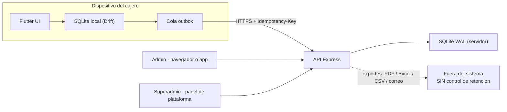
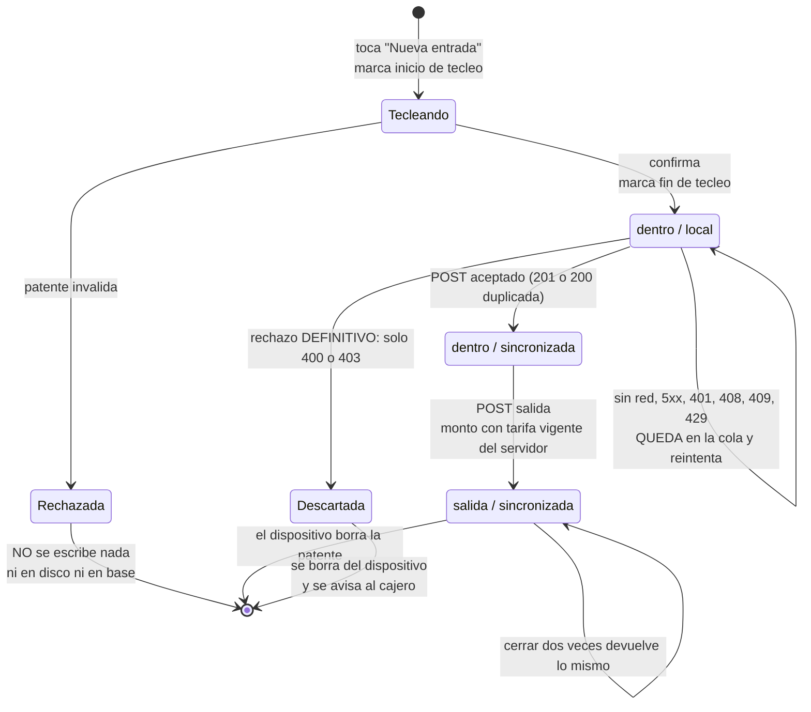
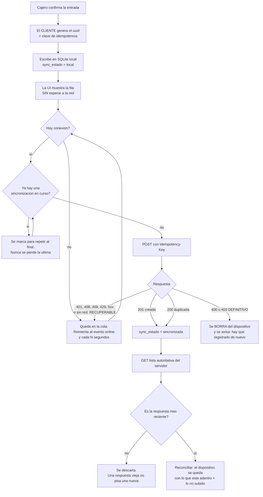
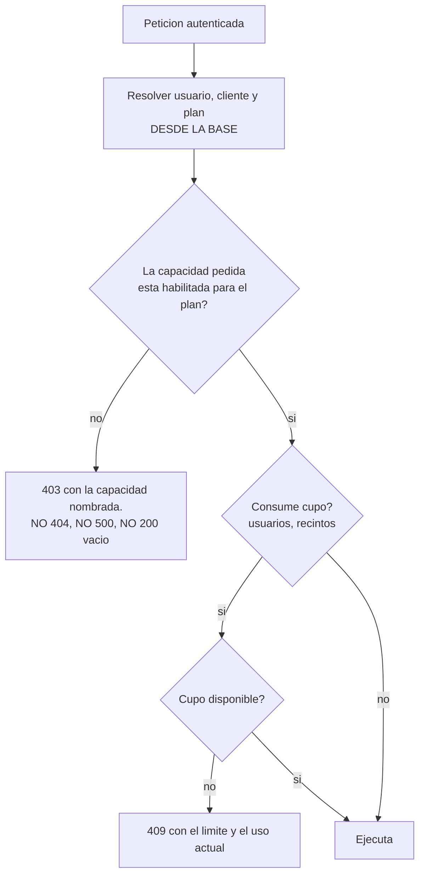

# Prompt maestro — ParkControl móvil (Flutter + Node) · v1

> **Cómo se usa:** pegar entero como **primer mensaje** en el repo `parkcontrol`.
> No es documentación del producto: es el contrato de trabajo del agente que lo
> construye.
>
> **Procedencia:** este documento traduce al contexto de ParkControl la
> disciplina de verificación del proyecto `Estacionamiento` (C4A). La tabla de
> §14 dice, sección por sección, de qué archivo de ese repo sale cada regla y qué
> le costó aprenderla. Lo que acá se afirma sobre **Estacionamiento** está
> verificado contra su árbol; lo que se afirma sobre **ParkControl** está
> **afirmado y sin verificar** — y esa distinción es el punto de partida de todo
> el trabajo (§1).

> **Este documento no viene solo.** Los artefactos derivados de la descripción y
> del diseño declarado ya están escritos y son la base del trabajo:
>
> | Archivo | Qué entrega |
> |---|---|
> | `parkcontrol/ACTORES-Y-CASOS-DE-USO.md` | 5 actores y 17 casos de uso con ficha, flujo y excepciones |
> | `parkcontrol/MER.md` | modelo entidad-relación del **servidor** y del **dispositivo**, con su gate y lo descartado |
> | `parkcontrol/MR.md` | tablas, claves, restricciones e índices para SQLite/WAL, y qué cambia al migrar |
> | `parkcontrol/FLUJOS.md` | ciclo de vida, outbox, turno y arqueo, decisión de plan, suspensión |
> | `parkcontrol/DISENO.md` | mapa de pantallas por rol, estados obligatorios y reglas de interfaz |
>
> Los cinco marcan **DECLARADO / INFERIDO / A VERIFICAR** fila por fila. Esa
> columna es el trabajo de §1: convertirla en medición contra el árbol real.

---

## 0. La regla que ordena todo lo demás

**Toda afirmación sobre el repositorio es verificable con un comando.**

Corolario operativo, que cuesta caro aprender de otro modo: *no alcanza con
medir antes de escribir; hay que buscar todas las ocurrencias de lo que acabás
de refutar.* Un `grep` del claim, no del dato.

Y su forma negativa, que es la que más veces salvó al proyecto de origen:

> **Un criterio que siempre pasa es peor que no tener criterio.**

Si algo de este documento no reproduce contra tu árbol: **decilo y pará.** No lo
acomodes, no lo "actualices" a mano, no escribas la versión que sí pasa.

---

## 1. Antes de escribir una línea — la descripción no es evidencia

El texto que circula sobre ParkControl —arquitectura, 27 pantallas, patrón
Outbox, planes Lite/Pro, aislamiento multi-inquilino— es una **descripción
generada**, probablemente por un agente leyendo el árbol. Está bien escrita y
**no es una medición**. Se parece exactamente a la forma de falla que el
proyecto de origen pagó varias veces: un documento plausible que describe algo
que el sistema **dejó de hacer** o **nunca hizo**, sin que ningún comando lo
note.

### 1.1 · Primera tarea: el barrido de premisas

Antes de tocar código, producí una **tabla de premisas** con tres columnas:
*afirmación · comando que la prueba · salida real*. Ninguna fila se llena de
memoria. Las que no puedas reproducir se marcan **NO VERIFICADO**, no se borran.

Mínimo obligatorio (adaptá los comandos a tu árbol; **si un comando no existe,
eso también es un hallazgo**):

| # | Afirmación a refutar | Cómo se prueba |
|---|---|---|
| 1 | *"Está en la rama que creo"* | `git branch --show-current` · `git log --oneline -5` · `git status --short` |
| 2 | *"El backend es la fuente de verdad del cálculo de tarifas"* | buscá el cálculo **en Dart**: si existe una función que calcula monto en el cliente, hay dos fuentes de verdad y una va a divergir |
| 3 | *"SQLite está en WAL"* | `PRAGMA journal_mode;` contra el archivo real, no contra la línea que lo configura |
| 4 | *"Hay idempotencia por `Idempotency-Key`"* | que el header **se envíe** es la mitad; la otra es qué hace el servidor cuando llega repetido. Probalo con dos POST idénticos y mirá las **filas**, no el código de estado |
| 5 | *"Multi-inquilino aislado"* | ver §6. Con **un solo** cliente sembrado, el aislamiento se cumple por casualidad |
| 6 | *"Los límites del plan se validan en el backend"* | cortá la UI y pegale directo a la API con un token de plan Lite pidiendo una capacidad Pro |
| 7 | *"27 pantallas"* | contalas de verdad: `find lib/screens -type f -name '*.dart'` y contá la salida. Un número en un documento no es un inventario |
| 8 | *"Las pruebas del backend prueban aislamiento y contratos"* | corré `npm test` y **leé qué asevera cada caso**. Una suite que pasa sobre el conjunto vacío no prueba nada (§9.2) |

### 1.2 · Lo que sale de acá

Un archivo `docs/PREMISAS-<fecha>.md` con esa tabla y su fecha y commit. Es el
insumo de todo lo demás. **Si la tabla contradice este prompt, manda la tabla** y
este documento se corrige.

---

## 2. Qué es ParkControl — versión corregida de la descripción

Lo que sigue reescribe la descripción original **separando lo que el producto
hace de lo que alguien dijo que hace**, y agregando lo que la descripción callaba
—que es donde vive el riesgo—.

### 2.1 · Propósito, dicho como hipótesis y no como catálogo

Un producto se justifica por lo que prueba, no por lo que lista. ParkControl
existe para sostener tres apuestas, y cada una necesita un número, no una
pantalla:

- **H1 · velocidad** — un cajero registra entrada y salida más rápido que en el
  cuaderno. *Sin esto, la app no se adopta y el resto es decoración.*
- **H2 · visibilidad que se paga** — un administrador paga una suscripción por
  ver ingresos, ocupación y descuadre que hoy no puede verificar.
- **H3 · continuidad** — la operación **no se detiene sin internet**. Es la
  promesa más cara del producto y la más fácil de romper en silencio.

> **Escribí en el repo cuál es tu criterio de "validado" para cada una, con su
> umbral, o dejá el umbral como `{{placeholder}}` (§10).** *Medir no requiere
> umbral; comparar sí.* Un dashboard sin `n` no es evidencia.

### 2.2 · Arquitectura afirmada — con lo que hay que verificar de cada capa

| Capa | Afirmado | Lo que hay que verificar, y por qué |
|---|---|---|
| **Cliente** | Flutter (Android · iOS · Web/PWA) | Que las tres plataformas **compilen hoy**. Y que el offline funcione en Web: IndexedDB no es SQLite; si Drift cae a otra implementación en web, la promesa de §2.1/H3 vale distinto por plataforma y hay que decirlo |
| **Backend** | Node + Express, fuente de verdad de seguridad, cuotas y tarifas | *Fuente de verdad* es una propiedad verificable: significa que **ningún cálculo de monto ni ninguna decisión de permiso se resuelve solo en el cliente**. Se prueba pegándole a la API sin pasar por la app |
| **Base servidor** | SQLite + WAL (`better-sqlite3`), "listo para migrar a PostgreSQL" | WAL da **un escritor y N lectores**: no es concurrencia libre. *"Listo para migrar"* es una afirmación sin comando — o existe una capa de acceso sin SQL específico de SQLite y se prueba, o es una intención. Marcala como intención hasta entonces |
| **Base local** | SQLite en el dispositivo vía Drift | La base local guarda **patentes**: es tratamiento de dato personal en un equipo compartido entre turnos (§8) |
| **Sincronización** | Patrón Outbox + `Idempotency-Key` | Es el corazón del sistema. §5 y §7 lo detallan: **la clasificación de errores importa más que el reintento** |

### 2.3 · Lo que la descripción original no dice, y hay que decidir

Un documento que calla se lee como completo. Estos huecos son de producto, no de
redacción:

1. **El dinero está adentro.** Hay cobro, turnos de caja y arqueo. Eso lo pone en
   otra categoría de riesgo que un sistema que solo muestra el monto: aparece
   **fraude interno**, **descuadre atribuible a una persona** y **auditoría**.
   Nada de eso se resuelve con una pantalla de reporte.
2. **La app calcula montos.** Si el cliente puede quedar sin red y el servidor es
   la fuente de verdad de la tarifa, entonces **la salida offline muestra un
   monto que el servidor puede desmentir**. Decidilo explícitamente: o la salida
   exige red, o el monto local es provisorio y se marca como tal en pantalla.
   *No hay tercera opción honesta.*
3. **`superadmin` es el rol más peligroso del sistema.** Ve a todos los clientes.
   La pregunta que hay que responder por escrito: **¿puede ver una patente?**
   (§6.3).
4. **Los exportes (PDF, Excel, CSV, correo programado) sacan dato personal del
   sistema**, fuera de cualquier control de retención. §8.4.
5. **Suspensión del servicio por impago.** ¿Qué pasa con los vehículos que están
   **adentro** cuando el servicio se suspende? Un cajero que no puede registrar
   la salida de un auto que está en el patio es una falla de operación, no de
   facturación.

---

## 3. Actores y roles — la tabla es descriptiva, la autorización es de cada ruta

**Ocultar un botón no es negar un permiso.** La tabla vive en el código como
referencia; el control real lo hace cada endpoint, y se prueba desde afuera.

| Rol | Puede | **No puede** — y esto es la spec, no una restricción añadida |
|---|---|---|
| `superadmin` | alta y baja de clientes, planes, vencimientos, suspensión/reactivación, ver estado de alta | **ver patentes, ingresos ni operación de un cliente por ninguna ruta** (decisión a tomar en §6.3, pero tomala y escribila) |
| `admin` | tarifas, tolerancia, fraccionamiento; gestión de usuarios **dentro del límite del plan**; contabilidad, auditoría y reportes **de su recinto** | tocar datos de otro cliente; superar el límite de su plan por API; operar caja si el diseño lo separa |
| `cajero` | entradas, salidas, vehículos dentro, apertura/cierre de turno **de su recinto** | ver contabilidad; cambiar tarifas; ver otros turnos |
| **Conductor** | — | **no es actor del sistema**: no tiene cuenta, ni pantalla, ni fila. Aparece solo como sujeto del dato `patente` |

Reglas transversales que hacen que la tabla sea cierta:

- **El rol se relee del servidor en cada petición**, nunca se cree de lo que el
  token afirma. Sin esto, suspender a un cajero no tiene efecto hasta que expire
  su sesión — y "dar de baja" pasa a ser una promesa de interfaz.
- **El `cliente_id` / `tenant_id` nunca viene del cuerpo de la petición.** Sale de
  la fila del usuario autenticado, releída. Si el cliente lo manda, alguien lo va
  a cambiar.

---

## 4. Casos de uso — formato obligatorio

Cada caso se escribe con esta ficha. **Un paso es un acto discreto y citable.**
Un caso sin `archivo:línea` que lo ejecute no está construido; un caso sin
comando que lo verifique se marca **BRECHA**, no "cerrado".

```
CU-XX · <nombre>
Actor · Precondición · Postcondición · Implementación (archivo:línea) · Verificado por (comando)
Flujo principal: pasos numerados, sin saltos, cada uno con su cita
Flujo(s) de excepción: E1, E2… viven DENTRO del caso que interrumpen
```

### 4.1 · El mapa mínimo de ParkControl

| ID | Caso | Actor | Nota de riesgo |
|---|---|---|---|
| CU-01 | Iniciar sesión | cualquiera | límite de intentos; el bloqueo por fuerza bruta **también frena la credencial correcta**: es por diseño, pero es un DoS de cuenta si el límite es solo por email |
| CU-02 | **Registrar entrada sin conexión** | cajero | el caso que sostiene H1 y H3. §5 |
| CU-03 | Sincronizar al reconectar | sistema | idempotencia y clasificación de errores. §7.3 |
| CU-04 | Registrar salida y cobrar | cajero | **decisión pendiente**: ¿offline sí o no? §2.3 punto 2 |
| CU-05 | Ver vehículos dentro | cajero | la lista es la **unión** de servidor y dispositivo, deduplicada por `id`, con el servidor pisando |
| CU-06 | Abrir turno de caja | cajero | monto inicial declarado |
| CU-07 | Cerrar turno y arquear | cajero | **diferencia = declarado − esperado.** Ver §4.2 |
| CU-08 | Configurar tarifa, tolerancia y fraccionamiento | admin | **versionar, nunca actualizar**. §7.5 |
| CU-09 | Ver contabilidad y reportes | admin | los números salen de la base, no de la maqueta |
| CU-10 | Gestionar usuarios dentro del límite del plan | admin | §9.3 |
| CU-11 | Alta de cliente y plan | superadmin | debe ser **transaccional**: un alta a medias deja un recinto que no puede cobrar |
| CU-12 | Suspender / reactivar servicio | superadmin | §2.3 punto 5 |
| CU-13 | Exportar PDF / Excel / CSV / correo | admin (Pro) | saca dato personal del sistema. §8.4 |
| CU-14 | **Medir H1** | analista | ¿existe el actor? ¿existe la consulta? Si no, es **BRECHA** y es la más cara |

> **CU-14 es la que se olvida.** En el proyecto de origen, la hipótesis que
> justificaba el producto entero **nunca se midió** — y el criterio que debía
> vigilarlo estuvo meses en verde porque era universal (§9.2). Si ParkControl no
> tiene una consulta que publique la mediana del tiempo de registro con su
> tamaño de muestra, escribila **antes** que la próxima pantalla.

### 4.2 · El caso que la descripción trata como trámite: el arqueo

CU-07 es el único lugar del sistema donde **el dinero declarado por una persona
se compara con lo que el sistema esperaba**. Tres decisiones que hay que tomar y
escribir:

1. **La diferencia, ¿se persiste?** Si sí, estás guardando una acusación con
   historia sobre una persona identificable. Es defendible —hay dinero de por
   medio— pero **exige base de licitud, plazo de retención y que la persona lo
   sepa** (§8). No es lo mismo que hacerla visible en pantalla y no guardarla.
2. **¿Qué entra en "esperado"?** Salidas cerradas en la ventana del turno, con
   qué zona horaria y con qué corte. Un corte de día calculado en la zona del
   servidor y no en la del recinto produce descuadres fantasma.
3. **¿Un turno se puede cerrar con la cola de sincronización sin vaciar?** Si el
   dispositivo tiene registros que no subieron, el "esperado" del servidor está
   incompleto. **Cerrar el turno igual es fabricar un descuadre.**

---

## 5. Diagramas — derivados del código, no del docstring

Los tres primeros son **obligatorios** en `docs/`, y cada transición lleva su
cita. Ninguno se dibuja de memoria.

### 5.1 · Contexto



**Lo que el diagrama hace visible:** la flecha punteada. Todo lo que sale por ahí
deja de estar cubierto por cualquier política de retención que escribas (§8.4).

### 5.2 · Ciclo de vida de una sesión de vehículo

Dos dimensiones que **no hay que confundir**: `estado` dice dónde está el
vehículo; `sync_estado` dice dónde está el registro.



**Preguntá al árbol, no a este diagrama:** ¿existe el estado `salida / local`?
Si tu app cierra salidas offline, **existe**, y entonces el monto que muestra
puede no ser el que el servidor va a registrar (§2.3 punto 2). Dibujalo como es
y decidí después.

### 5.3 · Outbox, con resolución servidor-autoritativa



Cuatro propiedades que este dibujo esconde si no se escriben aparte, y que en el
proyecto de origen fueron **cuatro defectos reales**:

1. **El `id` lo genera el cliente.** Sin id estable, una reconexión inestable
   duplica sesiones en cada reintento.
2. **Una sincronización a la vez, con "repetir al final".** Sin esa guarda, cada
   entrada relanza la cola entera: una patente llegó a postearse **cuatro veces**.
3. **Guarda de orden en las respuestas.** Un `GET` que sale antes del `INSERT` y
   vuelve corto deja la ocupación en 0 con el patio lleno.
4. **Memoria de cierres recientes.** Una respuesta del servidor emitida *antes*
   de un cierre local vuelve a escribir una patente que ya se había borrado.

### 5.4 · El diagrama que la descripción no tiene: la decisión de plan



**La regla que lo hace no-decorativo:** el chequeo vive en un envoltorio por el
que pasan **todas** las rutas, y se verifica **por exclusión** — un barrido del
árbol que falla si alguna ruta se registra por fuera del envoltorio. Una lista
blanca de rutas protegidas deja agujeros por construcción: la ruta nueva que
alguien agregue mañana nace sin control.

---

## 6. Aislamiento multi-inquilino — donde se juega el producto entero

### 6.1 · La propiedad, enunciada de modo que pueda fallar

> **Ningún dato de un cliente es legible ni alcanzable desde otro.** Con **dos**
> clientes sembrados, un usuario de A no obtiene ningún recurso de B por ningún
> camino: ni en el listado, ni conociendo el `id`, ni por un reporte, ni por un
> export, ni por un PDF.
>
> **Y exige ver lo propio**, o "no ve lo de B" sería cierto por vacío.

### 6.2 · El control negativo, que casi nunca existe

Con **un solo** cliente sembrado, el aislamiento se cumple por casualidad y esa
casualidad es toda la separación que hay. El verificador tiene que:

1. sembrar **dos** clientes con datos distinguibles,
2. autenticarse como usuario de A,
3. intentar alcanzar cada recurso de B **por id directo**, no solo por listado,
4. afirmar que ve lo suyo,
5. y —lo que casi nadie hace— **probarse a sí mismo**: borrá una cláusula de
   aislamiento real en el código y confirmá que el verificador **falla**. Si
   sigue en verde, el verificador no verifica.

**Un recurso de otro cliente responde 404, no 403.** La diferencia entre "no
existe" y "no es tuyo" ya es información.

### 6.3 · La pregunta sobre `superadmin`, que hay que responder por escrito

El rol con más privilegio es el que más hay que acotar. En el proyecto de origen
la respuesta fue tajante y verificada por comando: **el rol de plataforma no
obtiene ninguna patente por ninguna ruta**, y el listado de clientes muestra
nombre, capacidad, zona horaria, fecha de alta y **cantidad** de usuarios — sin
ocupación, sin ingresos, sin correos, sin patentes.

En ParkControl hay más razones para necesitar visibilidad (soporte, cobranza,
suspensión). Elegí, escribilo, y hacelo cumplir por exclusión:

- **Opción A — ciego:** `superadmin` no ve dato personal ni operación. Más simple
  de defender legalmente; obliga a que el soporte pida datos al cliente.
- **Opción B — con ventana auditada:** puede ver, cada acceso queda registrado
  con quién, cuándo y a qué cliente, y el cliente puede verlo. **Sin el registro,
  la opción B no existe: es la A rota.**

---

## 7. Contrato de API — derivado del código, no al revés

Escribí `docs/CONTRATO-api.md` con esta forma. Si el contrato y una ruta
discrepan, **manda la ruta** y el contrato está mal.

### 7.1 · Autenticación
Cómo se emite el token, dónde vive, cuánto dura, y **que el rol se relee de la
base en cada petición**. Si es JWT sin relectura, decilo: revocar un usuario no
tiene efecto hasta que expire.

### 7.2 · Forma de los errores
Una sola forma, siempre, con los campos extra documentados. Y **el error de
frontera nombra exactamente el campo que falló** — devolver "datos inválidos" a
secas obliga al cliente a adivinar y al soporte a pedir capturas. Cuando hay
varios campos malos, **se devuelven todos**, no el primero.

### 7.3 · La tabla más importante del sistema

| Código | Significado | Qué hace la cola local |
|---|---|---|
| 400, 403 | rechazo definitivo | **borra** el registro del dispositivo |
| 401, 408, 409, 429, 5xx | recuperable | lo deja en cola **y corta el lote** |

Dos consecuencias que el sistema debe respetar **en todas partes**:

- **Nunca devolver 5xx por un dato que la base jamás va a aceptar.** Sería un
  reintento infinito que bloquea la sincronización entera del turno — y con ella
  la evidencia de H1.
- **Nunca devolver 400 por un fallo de infraestructura.** El dispositivo borraría
  un registro que era válido. Los fallos de infraestructura son **503 con
  `Retry-After`**, y distinguen configuración de base de datos.

> **Y revisá el 404.** Si un 404 se clasifica como definitivo, un deploy que
> devuelva 404 durante 30 segundos **borra ingresos**; si se clasifica como
> recuperable, una ruta que ya no existe **bloquea la cola para siempre**. No hay
> opción gratis: es decisión de producto y va escrita, con su motivo.

### 7.4 · Idempotencia — en capas, y el caso que la prueba
Tres capas, y las tres hacen falta: **id generado por el cliente**, *upsert* o
`ON CONFLICT DO NOTHING` sobre ese id, y un **índice único parcial** del tipo
`(cliente_id, patente) WHERE estado = 'dentro'` cuyo choque se traduce a una
respuesta de éxito y **no** a un 500.

**El caso simultáneo no prueba idempotencia; el diferido sí.** Dos POST a la vez
pueden pasar por suerte de scheduling. La prueba real es: postear, **esperar a
que termine**, y postear otra vez el mismo id. Y para el cierre: N salidas
simultáneas sobre la misma sesión producen **un solo cierre**, con un único monto
idéntico en todas las respuestas. Medí antes de corregir: es habitual que **ocho
salidas simultáneas cierren las ocho, con ocho horas distintas**.

### 7.5 · Tarifas: se insertan, nunca se actualizan
Cambiar una tarifa crea una **fila nueva** con su `vigente_desde`. Las anteriores
quedan. Es lo que permite recalcular una salida vieja con la tarifa que regía
entonces, y lo que hace cierta la promesa "las salidas ya cobradas conservan su
valor".

**`vigente_desde` lo pone el servidor, nunca el cuerpo.** Aceptarlo del cliente
permite antedatar una versión y **cambiar retroactivamente montos ya cobrados en
efectivo**.

Y una deuda de auditoría que conviene no heredar: si la sesión guarda el monto
pero **no con qué tarifa** se calculó, un admin que cambia la tarifa y después
audita un monto no puede reconstruirlo. La visibilidad *es* el producto.

### 7.6 · Lo que el contrato NO cubre
Escribilo. Un contrato que calla se lee como completo: sin endpoint de lotes, sin
versionado, sin límite de tamaño de cuerpo, sin rate limit fuera del login, sin
endpoint de salud. Cada omisión, dicha, es una decisión; callada, es una sorpresa.

---

## 8. Datos personales — Ley 21.719 (Chile), vigencia plena 1 de diciembre de 2026

### 8.1 · Qué es dato personal acá
La **patente** lo es. El **email del usuario** también —identifica a una persona
natural—. Los datos del negocio (razón social, capacidad, zona horaria) no lo son
por sí mismos.

### 8.2 · Minimización, como requisito estructural
Solo los campos que responden una hipótesis o una obligación operativa. **Ningún
campo "por si sirve".** En particular: **no crees una entidad `vehiculo`.** La
patente es un atributo de la sesión. Una tabla de vehículos construye un
**historial de movimientos por persona identificable** que ninguna hipótesis pide
y que la ley obliga a justificar.

### 8.3 · Las dos decisiones que bloquean operar con datos reales
`{{PLAZO_RETENCION_PATENTE}}` y `{{BASE_LICITUD}}`. **No las inventes.** Mientras
no estén resueltas, el sistema opera con un interruptor tipo
`OPERACION_REAL_HABILITADA=false` que rechaza patentes que no sean de prueba
**en el cliente, antes de escribir en disco** —recolectar y almacenar localmente
ya es tratamiento— y otra vez en el servidor, porque la del servidor llega tarde.

Y una que el proyecto de origen descubrió tarde: **no hay plazo de retención, ni
siquiera pendiente, para los datos de los operadores.** Con multi-inquilino ese
vacío se multiplica por cliente. Propuesto: `{{PLAZO_RETENCION_USUARIO}}`.

### 8.4 · Exportes y comprobantes: la puerta trasera
Un PDF con patentes, un Excel con movimientos y un **correo programado** son
salidas de dato personal fuera de todo control de retención. Mínimo exigible:

- que el export diga qué dato personal contiene y a nombre de quién se emite,
- que exista un registro de quién exportó qué y cuándo,
- que el envío programado tenga destinatario verificado y se pueda cortar,
- y que **el plazo de retención aplique también a lo exportado**, o que se declare
  explícitamente que no aplica y por qué.

### 8.5 · Higiene del dispositivo compartido
Los turnos comparten equipo. Al cerrar sesión: **primero** confirma el servidor,
**después** se vacía la base local, y se recarga completo —no navegación de
cliente— porque en el estado en memoria viven las últimas salidas con sus
patentes. Y **si quedan registros sin sincronizar, la sesión no se cierra**: se
explica por qué.

---

## 9. Criterios de aceptación — con comando, con tipo, y probados fallando

### 9.1 · La forma
Cada criterio: **un ID, una propiedad, un comando**. Nunca un número —los
conteos crecen y el AC queda falso al día siguiente— y nunca el nombre de una
herramienta externa, que caduca cuando la herramienta cambia. **Describí la
propiedad; sugerí la herramienta.**

### 9.2 · La columna que evita el criterio vacío

| Tipo | Forma | Trampa |
|---|---|---|
| **universal** | *"todo X cumple P"* | **pasa sobre el conjunto vacío.** Si no hay ningún X, es automáticamente verdadero |
| **existencial** | *"existe al menos un X"* | no puede pasar sobre la nada; su salida útil es **un número**, no un veredicto |

Que un AC sea universal no lo vuelve malo —"el proyecto compila" no puede ser
otra cosa—. Lo malo es **no saber cuáles pueden aprobar la nada**. Exigí que cada
AC declare su tipo y que **al menos uno sea existencial**.

### 9.3 · El mínimo para ParkControl

| ID | Criterio | Tipo |
|---|---|---|
| **AC-BUILD-1** | El proyecto compila: backend arranca, `flutter build` en las plataformas declaradas | universal |
| **AC-OFF-1** | Con el dispositivo **sin red**, una entrada se registra, persiste localmente y aparece en la lista sin esperar al servidor; al reconectar sube y queda sincronizada | **existencial** |
| **AC-IDEM-1** | Reenviar la misma operación **con espera entre intentos** no crea una segunda fila; N salidas simultáneas producen un solo cierre con un solo monto | **existencial** |
| **AC-ISO-1** | Con **dos** clientes sembrados, un usuario de A no alcanza ningún recurso de B por ningún camino, **y ve lo suyo** | **existencial** |
| **AC-ISO-2** | `superadmin` no obtiene ninguna patente por ninguna ruta — comprobado **por exclusión** sobre toda la superficie de plataforma, no enumerando rutas | universal |
| **AC-PLAN-1** | Ninguna capacidad Pro se ejecuta con un plan Lite **pegándole directo a la API**, sin pasar por la UI | universal |
| **AC-PLAN-2** | El límite de usuarios del plan se hace cumplir en el backend: crear el usuario N+1 responde el límite y el uso actual, y **no crea la fila** | **existencial** |
| **AC-API-1** | **Ninguna entrada malformada produce 5xx.** Cualquier valor degenerado, en cualquier campo, se responde como rechazo de cliente | universal |
| **AC-TAR-1** | El monto se calcula en el servidor con la tarifa vigente; cambiar la tarifa crea versión nueva y **no altera** montos ya cerrados | universal |
| **AC-CAJA-1** | El cierre de turno compara declarado contra esperado en la zona horaria del recinto, y **no se puede cerrar con cola pendiente** sin decirlo | **existencial** |
| **AC-PDP-1** | Con operación real deshabilitada, una patente no-fixture **no se guarda en el dispositivo**, no entra a la cola y no llega a la base | **existencial** |
| **AC-H1-1** | El sistema publica la **mediana** del tiempo de registro con su **tamaño de muestra**, separando datos de prueba de operación real. **Falla si no hay datos** | **existencial** |

### 9.4 · La regla que hace que un verificador valga algo

> **Un gate que solo se probó contra un repo limpio no se probó.**

Cada verificador se corre **con el fallo plantado**: rompé a propósito la
propiedad que vigila y confirmá que **falla**, con la salida pegada. Después
revertí. Un verificador sin esa prueba es una afirmación, no una medición.

### 9.5 · Y no publiques una salida que no corriste
Nunca una transcripción con prompt `$` que no ejecutaste. Nunca un número de la
corrida anterior presentado como de hoy. Si algo no se pudo correr, **eso es el
resultado** y se reporta así.

---

## 10. Placeholders — no inventar valores

Los `{{placeholder}}` son decisiones humanas pendientes. **No los rellenes con
supuestos, ni con valores "razonables", ni con ejemplos que parezcan reales.** Si
falta un valor: pará y pedilo.

Abiertos para ParkControl, como mínimo:

| Placeholder | Qué es | Bloquea |
|---|---|---|
| `{{BASE_LICITUD}}` | base de licitud del tratamiento de la patente | operar con datos reales |
| `{{PLAZO_RETENCION_PATENTE}}` | ventana de retención | ídem, y los exportes |
| `{{PLAZO_RETENCION_USUARIO}}` | retención de datos de cajeros y admins | multi-inquilino |
| `{{PRECIO_PLAN_LITE}}` / `{{PRECIO_PLAN_PRO}}` | precio real | validar disposición a pagar |
| `{{UMBRAL_H1_SEGUNDOS}}` / `{{LINEA_BASE_CUADERNO_SEGUNDOS}}` | objetivo y línea base | concluir sobre H1 |
| `{{N_MINIMO_H1}}` | muestra mínima para que una mediana signifique algo | leer el número como evidencia |
| `{{INSTANTE_FACTURABLE}}` | ¿el momento en que el cajero tocó *Salida* o el que el servidor registró? | quién paga la falta de señal |
| `{{POLITICA_SUSPENSION}}` | qué pasa con vehículos adentro al suspender el servicio | CU-12 |

**Tampoco inventes datos de prueba que parezcan reales.** Patentes, nombres de
estacionamientos y montos de operación de los fixtures **deben verse como
fixtures** — con un prefijo reservado que el código reconozca. Si no se
distinguen, cualquier medición mezcla robot con persona y el número deja de
significar algo.

---

## 11. Diseño e interfaz — lo que se exige, no lo que se sugiere

1. **Tokens, no literales.** Todo color, radio, sombra y familia tipográfica sale
   de una variable declarada **una sola vez**. Verificable: cero literales hex en
   los componentes.
2. **Cero recursos de terceros en tiempo de ejecución.** Fuentes autoalojadas,
   íconos como paquete fijado o SVG inline; nunca un CDN sin versión. Dos razones
   medibles: la política de seguridad de contenido, y que **cada carga desde un
   tercero es una petición del dispositivo del cajero con su IP** — en un producto
   cuyo argumento es que trata pocos datos.
3. **El estado de red es contenido de primer nivel, no un ícono.** Se muestra el
   badge *Sin conexión* **y el conteo**: *"3 registros esperando red"*. Y el
   mensaje promete continuidad, no solo persistencia: *"Se guardaron en este
   equipo. Suben solos al reconectar; podés seguir registrando."*
4. **Ninguna pantalla muestra un dato inventado.** Ni un promedio de ejemplo, ni
   un "6,2 s" heredado de la maqueta. Si una cifra todavía no se puede calcular,
   **va vacía con su motivo**, y el verificador **falla si alguien publica un
   número ahí**.
5. **La pantalla de entrada es la que sostiene H1.** Foco automático en el campo
   de patente, teclado adecuado, normalización visible —*"se normaliza sola, sin
   guiones ni espacios"*—, y **guarda de reentrancia en Confirmar**: el doble
   toque duplica el ingreso, y es un defecto real, no teórico.
6. **Accesibilidad mínima real:** foco visible, roles y etiquetas en los
   controles, contraste suficiente. Se verifica en el DOM/árbol de accesibilidad,
   no a ojo.

---

## 12. Cómo trabajar

- **WIP = 1.** Un hito a la vez. No se abre el siguiente hasta que los criterios
  del actual estén **verificados con su comando**, no razonados. La disciplina se
  rompe donde uno se siente cómodo: el segundo frente siempre parece barato.
- **Auditoría adversarial por iteración**, máximo 3 ciclos. Si el tercero no
  pasa: **HALT y reportar**, no forzar.
- **Verificá las afirmaciones del auditor antes de aceptarlas** y decí cuáles
  reprodujiste y cuáles no.
- **Las citas `archivo:línea` tienen que decir lo que afirmás**, no solo existir.
- **No commitees sobre rojo.** Si la regresión tiene un FAIL sin diagnosticar, el
  trabajo es ese FAIL.
- **Registro en tres archivos**, y cada uno tiene un trabajo distinto:

| Archivo | Qué es | Regla |
|---|---|---|
| `LEDGER.md` | verdad histórica | **append-only**. PASS/FAIL con la **salida real** del comando |
| `STATE.md` | cursor de reanudación | sobrescribible, corto. Puntero para retomar sin releer el ledger |
| `LEARNINGS.md` | la lección de fondo | qué modo de falla se descubrió y **qué mecanismo lo vuelve imposible** |

> **Un FAIL a propósito no es una regresión.** Si un criterio existencial falla
> porque todavía no hay datos, **eso es la medición** y tiene que quedar escrito
> así, o el próximo lector lo va a "arreglar".

---

## 13. Definición de terminado — para cualquier entrega

1. La tabla de premisas de §1 existe y está fechada contra un commit.
2. Cada capacidad entregada tiene su **caso de uso** con pasos citados y su
   **criterio** con comando.
3. Cada criterio declara su **tipo** (§9.2) y al menos uno es existencial.
4. Cada verificador nuevo se corrió **con el fallo plantado** y se pegó su salida.
5. La regresión completa está en verde, o el rojo está **diagnosticado y escrito**.
6. Ningún `{{placeholder}}` se rellenó con un supuesto.
7. Ningún dato de prueba se ve como dato real.
8. `LEDGER.md`, `STATE.md` y `LEARNINGS.md` actualizados con evidencia, no con
   descripciones.

---

## 14. Procedencia — de dónde sale cada regla y qué costó aprenderla

| Sección | Fuente en `Estacionamiento` | Lo que costó |
|---|---|---|
| §0 regla U7 | `PROMPT-FASE-D.md` §7 | dos correcciones arreglaron una mitad y dejaron viva la otra |
| §1 barrido de premisas | `PROMPT-FASE-D.md` §0 | artefactos citados que no estaban en la rama de trabajo |
| §3 roles descriptivos | `docs/CONTRATO-api.md` §1.2 | *ocultar un enlace no es negar un permiso* |
| §4 formato de casos de uso | `docs/data/casos-uso.md` | la primera versión describía flujos en prosa: se podía leer, no se podía citar un paso |
| §4.2 arqueo / descuadre | `docs/data/flujos.md` §3, `MER.md` §5 | un descuadre persistido es una acusación con historia sobre una persona identificable |
| §5.2–5.3 diagramas | `docs/data/flujos.md` §1–§2 | cuatro defectos reales: duplicados por reintento, cola re-posteada 4 veces, ocupación en 0 con el patio lleno, patente re-escrita tras el borrado |
| §5.4 gate por exclusión | `CLAUDE.md` §1, `spec.md` §9 AC-SCOPE-1 | tres bypasses reproducidos; una lista blanca no ve la ruta nueva |
| §6 aislamiento | `spec.md` §9 AC-ISO-1/2, `docs/data/actores.md` §3 | *con un solo cliente sembrado el resultado coincidía por casualidad, y esa casualidad era toda la separación que había* |
| §7.3 tabla de códigos | `docs/CONTRATO-api.md` §1.6 | tratar todo el 4xx como definitivo vaciaba la cola del cajero |
| §7.4 idempotencia | `docs/CONTRATO-api.md` §2, `LEARNINGS.md` 2026-08-18 | ocho salidas simultáneas cerraban las ocho, con ocho horas distintas |
| §7.5 tarifas versionadas | `docs/CONTRATO-api.md` `POST /api/tarifas` | antedatar una versión cambia montos ya cobrados |
| §8 datos personales | `spec.md` §4 y §7, `docs/data/MER.md` §5 y §6 | la entidad `vehiculo` construye un perfil que ninguna hipótesis pide |
| §9.1 AC sin número ni herramienta | `spec.md` §9, enmienda AC-PWA-1 | Lighthouse eliminó la categoría PWA y el criterio quedó inverificable en cualquier máquina |
| §9.2 universal vs existencial | `spec.md` §9, `LEARNINGS.md` 2026-08-16 | un criterio estuvo meses en verde sobre **cero** datos de operación |
| §9.4 fallo plantado | `CLAUDE.md` §1 | el gate reportaba PASS incondicional con dos pasarelas plantadas |
| §9.5 salida real | `LEARNINGS.md` 2026-08-14 | se publicó un `21/21` de la corrida anterior como *medido hoy* |
| §10 placeholders y fixtures | `spec.md` §12, `CLAUDE.md` §3 | un `6,2 s` inventado en una maqueta se leyó como dato |
| §11 diseño | `docs/diseno-2026-08-12-traduccion.md` §2 | el sistema de diseño traía dos dependencias por CDN incompatibles con la política de seguridad |
| §12 registro y WIP=1 | `CLAUDE.md` §2 y §6 | la deriva a WIP=2 rompió la disciplina justo donde era cómoda |

---

## 15. Lo que este documento **no** hace

- **No aprueba alcance.** Habilitar cobro del conductor, LPR, reservas o
  multisitio es decisión humana y va por ADR, no por implementación.
- **No autoriza operar con datos reales.** Eso depende de `{{BASE_LICITUD}}` y
  `{{PLAZO_RETENCION_PATENTE}}`.
- **No describe el árbol de ParkControl.** Todo lo que dice sobre ese producto
  viene de una descripción sin verificar: §1 existe para convertirla en evidencia
  o en hallazgo.
- **No introduce requisitos nuevos con forma de formalización.** Si una sección
  te obliga a construir algo que el producto nunca prometió, eso es autorar
  requisitos: se decide con el humano, por ADR.

