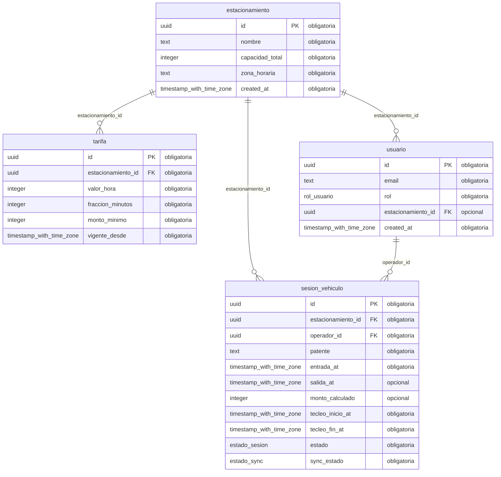

# Modelo de datos — extraído del motor

**Fecha:** 2026-08-20
**Fuente:** `pg_catalog` de la base viva en Railway, **no** el DDL ni
`src/db/schema.ts`. Es la regla que `verificar:esquema` ya aplica: el DDL dice
lo que alguien quiso, el motor dice lo que hay.

**Generado por** `extraer-modelo.mjs`. No editar a mano: se regenera.

**4 entidades** en el esquema `public`.

---

## Diagrama entidad-relación

---

## Entidades, campo por campo

### `estacionamiento`

Filas vivas (aprox., `pg_stat_user_tables`): **3**

| Campo | Tipo | Obligatorio | Por defecto |
|---|---|---|---|
| `id` | `uuid` | sí | `gen_random_uuid()` |
| `nombre` | `text` | sí | — |
| `capacidad_total` | `integer` | sí | — |
| `zona_horaria` | `text` | sí | — |
| `created_at` | `timestamp with time zone` | sí | `now()` |

**Restricciones declaradas en la base** (no en la aplicación):

- `capacidad_positiva` · **CHECK** · `CHECK ((capacidad_total > 0))`
- `estacionamiento_capacidad_total_not_null` · **n** · `NOT NULL capacidad_total`
- `estacionamiento_created_at_not_null` · **n** · `NOT NULL created_at`
- `estacionamiento_id_not_null` · **n** · `NOT NULL id`
- `estacionamiento_nombre_not_null` · **n** · `NOT NULL nombre`
- `estacionamiento_zona_horaria_not_null` · **n** · `NOT NULL zona_horaria`
- `estacionamiento_pkey` · **PK** · `PRIMARY KEY (id)`

### `sesion_vehiculo`

Filas vivas (aprox., `pg_stat_user_tables`): **2**

| Campo | Tipo | Obligatorio | Por defecto |
|---|---|---|---|
| `id` | `uuid` | sí | `gen_random_uuid()` |
| `estacionamiento_id` | `uuid` | sí | — |
| `operador_id` | `uuid` | sí | — |
| `patente` | `text` | sí | — |
| `entrada_at` | `timestamp with time zone` | sí | — |
| `salida_at` | `timestamp with time zone` | no | — |
| `monto_calculado` | `integer` | no | — |
| `tecleo_inicio_at` | `timestamp with time zone` | sí | — |
| `tecleo_fin_at` | `timestamp with time zone` | sí | — |
| `estado` | `estado_sesion` | sí | `'activa'::estado_sesion` |
| `sync_estado` | `estado_sync` | sí | `'local'::estado_sync` |

**Restricciones declaradas en la base** (no en la aplicación):

- `monto_no_negativo` · **CHECK** · `CHECK (((monto_calculado IS NULL) OR (monto_calculado >= 0)))`
- `salida_posterior_a_entrada` · **CHECK** · `CHECK (((salida_at IS NULL) OR (salida_at >= entrada_at)))`
- `tecleo_coherente` · **CHECK** · `CHECK ((tecleo_fin_at >= tecleo_inicio_at))`
- `sesion_vehiculo_estacionamiento_id_estacionamiento_id_fk` · **FK** · `FOREIGN KEY (estacionamiento_id) REFERENCES estacionamiento(id)`
- `sesion_vehiculo_operador_id_usuario_id_fk` · **FK** · `FOREIGN KEY (operador_id) REFERENCES usuario(id)`
- `sesion_vehiculo_entrada_at_not_null` · **n** · `NOT NULL entrada_at`
- `sesion_vehiculo_estacionamiento_id_not_null` · **n** · `NOT NULL estacionamiento_id`
- `sesion_vehiculo_estado_not_null` · **n** · `NOT NULL estado`
- `sesion_vehiculo_id_not_null` · **n** · `NOT NULL id`
- `sesion_vehiculo_operador_id_not_null` · **n** · `NOT NULL operador_id`
- `sesion_vehiculo_patente_not_null` · **n** · `NOT NULL patente`
- `sesion_vehiculo_sync_estado_not_null` · **n** · `NOT NULL sync_estado`
- `sesion_vehiculo_tecleo_fin_at_not_null` · **n** · `NOT NULL tecleo_fin_at`
- `sesion_vehiculo_tecleo_inicio_at_not_null` · **n** · `NOT NULL tecleo_inicio_at`
- `sesion_vehiculo_pkey` · **PK** · `PRIMARY KEY (id)`

**Índices** (sin contar el de la clave primaria):

- `sesion_vehiculo_activa_unica` · único · `CREATE UNIQUE INDEX sesion_vehiculo_activa_unica ON public.sesion_vehiculo USING btree (estacionamiento_id, patente) WHERE (estado = 'activa'::estado_sesion)`
- `sesion_vehiculo_por_estado` · `CREATE INDEX sesion_vehiculo_por_estado ON public.sesion_vehiculo USING btree (estacionamiento_id, estado)`
- `sesion_vehiculo_por_salida` · `CREATE INDEX sesion_vehiculo_por_salida ON public.sesion_vehiculo USING btree (estacionamiento_id, estado, salida_at)`

### `tarifa`

Filas vivas (aprox., `pg_stat_user_tables`): **3**

| Campo | Tipo | Obligatorio | Por defecto |
|---|---|---|---|
| `id` | `uuid` | sí | `gen_random_uuid()` |
| `estacionamiento_id` | `uuid` | sí | — |
| `valor_hora` | `integer` | sí | — |
| `fraccion_minutos` | `integer` | sí | — |
| `monto_minimo` | `integer` | sí | — |
| `vigente_desde` | `timestamp with time zone` | sí | — |

**Restricciones declaradas en la base** (no en la aplicación):

- `fraccion_positiva` · **CHECK** · `CHECK ((fraccion_minutos > 0))`
- `monto_minimo_no_negativo` · **CHECK** · `CHECK ((monto_minimo >= 0))`
- `valor_hora_no_negativo` · **CHECK** · `CHECK ((valor_hora >= 0))`
- `tarifa_estacionamiento_id_estacionamiento_id_fk` · **FK** · `FOREIGN KEY (estacionamiento_id) REFERENCES estacionamiento(id)`
- `tarifa_estacionamiento_id_not_null` · **n** · `NOT NULL estacionamiento_id`
- `tarifa_fraccion_minutos_not_null` · **n** · `NOT NULL fraccion_minutos`
- `tarifa_id_not_null` · **n** · `NOT NULL id`
- `tarifa_monto_minimo_not_null` · **n** · `NOT NULL monto_minimo`
- `tarifa_valor_hora_not_null` · **n** · `NOT NULL valor_hora`
- `tarifa_vigente_desde_not_null` · **n** · `NOT NULL vigente_desde`
- `tarifa_pkey` · **PK** · `PRIMARY KEY (id)`

### `usuario`

Filas vivas (aprox., `pg_stat_user_tables`): **7**

| Campo | Tipo | Obligatorio | Por defecto |
|---|---|---|---|
| `id` | `uuid` | sí | `gen_random_uuid()` |
| `email` | `text` | sí | — |
| `rol` | `rol_usuario` | sí | — |
| `estacionamiento_id` | `uuid` | no | — |
| `created_at` | `timestamp with time zone` | sí | `now()` |

**Restricciones declaradas en la base** (no en la aplicación):

- `pertenencia_por_rol` · **CHECK** · `CHECK (((((rol)::text = 'plataforma'::text) AND (estacionamiento_id IS NULL)) OR (((rol)::text <> 'plataforma'::text) AND (estacionamiento_id IS NOT NULL))))`
- `usuario_estacionamiento_id_estacionamiento_id_fk` · **FK** · `FOREIGN KEY (estacionamiento_id) REFERENCES estacionamiento(id)`
- `usuario_created_at_not_null` · **n** · `NOT NULL created_at`
- `usuario_email_not_null` · **n** · `NOT NULL email`
- `usuario_id_not_null` · **n** · `NOT NULL id`
- `usuario_rol_not_null` · **n** · `NOT NULL rol`
- `usuario_pkey` · **PK** · `PRIMARY KEY (id)`
- `usuario_email_unique` · **única** · `UNIQUE (email)`

**Índices** (sin contar el de la clave primaria):

- `usuario_email_unique` · único · `CREATE UNIQUE INDEX usuario_email_unique ON public.usuario USING btree (email)`

---

## Lo que este documento NO dice

- **No es la especificación.** `spec.md` §4 manda; esto es lo que la base
  tiene hoy. Si divergen, es un hallazgo, y `AC-DATA-1` es quien lo detecta.
- **No incluye datos.** Los conteos son estadísticas del motor, no filas.
  Ninguna patente sale de la base por acá.

