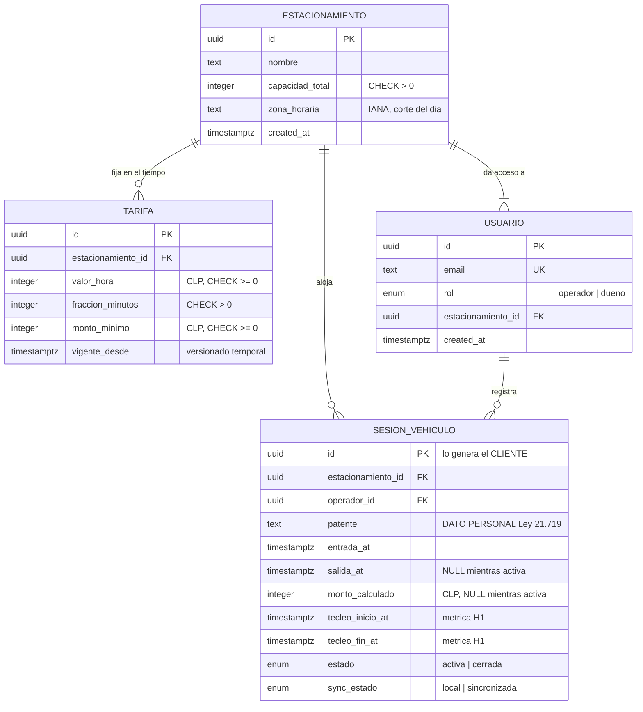
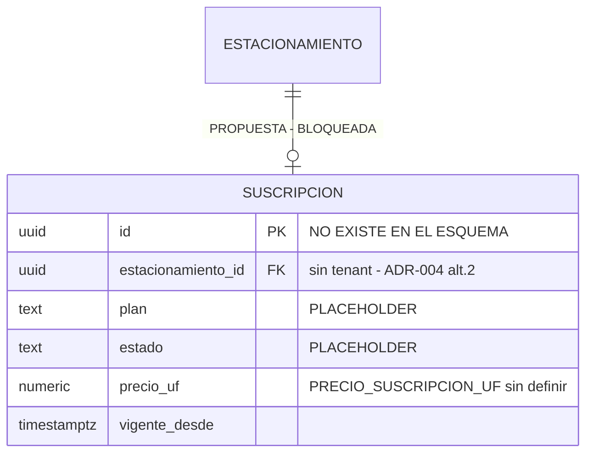

# MER — Modelo entidad-relación

> **Derivado, no diseñado.** Cada entidad y cada atributo sale de
> `src/db/schema.ts` o de `spec.md` §4, con su cita. Nada se agrega "porque el
> modelo quedaría más completo".
>
> Insumo: `docs/data/inventario.md` (FASE 0).
> Fecha: 2026-08-13 · Árbol: commit `8c28d9a`

---

## 1. El gate de este modelo

Antes de que una entidad, un campo o una relación entre al MER tiene que
responder **sí** a una de estas tres:

1. **H1** — ¿sirve para medir la velocidad de registro? (`spec.md` §1, §6)
2. **H2** — ¿sirve para que un dueño vea lo que hoy no puede verificar, y por eso
   pague? (`spec.md` §1, §6)
3. **Obligación operativa o legal explícita** — ¿lo exige operar el flujo de
   `spec.md` §5, o la Ley 21.719 (§7)?

Lo que no pasa se lista en §5 con su razón. **No entra al diagrama.**

---

## 2. Diagrama

### Propuesta bloqueada — no forma parte del modelo vigente

**Estado: PROPUESTA BLOQUEADA.** ADR-004 se aceptó en su alternativa 2 —cobro de
suscripción sí, multisitio no—, pero el propio ADR condiciona: *"hasta que
`AC-SCOPE-1` se reescriba en `spec.md` §9, no entra ninguna dependencia de
pasarela"*. Además `{{PRECIO_SUSCRIPCION_UF}}` no existe, así que `precio_uf` no
tiene dominio definido. **No hay tabla `suscripcion` en `src/db/schema.ts`** y
este loop no la crea.

---

## 3. Trazabilidad de cada entidad

| Entidad | Origen en código | Origen en spec | Gate |
|---|---|---|---|
| `ESTACIONAMIENTO` | `src/db/schema.ts:33` | `spec.md` §4 | H2 (capacidad → ocupación) + operativa (zona horaria → corte del día) |
| `USUARIO` | `src/db/schema.ts:50` | `spec.md` §4 | operativa (`spec.md` §3: dos roles) + H2 (separar quién observa de quién opera) |
| `TARIFA` | `src/db/schema.ts:68` | `spec.md` §4 | operativa (`spec.md` §5: el monto se computa desde la tarifa) |
| `SESION_VEHICULO` | `src/db/schema.ts:105` | `spec.md` §4 | **H1 y H2 a la vez** — es el corazón de la v1 |
| `SUSCRIPCION` | — no existe — | — | H2, pero **bloqueada** por ADR-004 + AC-SCOPE-1 |

---

## 4. Relaciones: cardinalidad y participación

| Relación | Cardinalidad | Participación | Evidencia |
|---|---|---|---|
| `ESTACIONAMIENTO` → `TARIFA` | 1:N | tarifa **obligatoria** (FK NOT NULL, `schema.ts:72`); estacionamiento **opcional** (puede no tener tarifa aún) | `schema.ts:74` |
| `ESTACIONAMIENTO` → `USUARIO` | 1:N | usuario **obligatoria** (`schema.ts:54`); estacionamiento **obligatoria en la práctica** — sin al menos un usuario nadie puede operarlo | `schema.ts:56` |
| `ESTACIONAMIENTO` → `SESION_VEHICULO` | 1:N | sesión **obligatoria** (`schema.ts:109`); estacionamiento opcional (puede estar vacío) | `schema.ts:111` |
| `USUARIO` → `SESION_VEHICULO` | 1:N | sesión **obligatoria** (`schema.ts:112`); usuario opcional (un dueño nunca registra) | `schema.ts:114` |

### Por qué no hay ninguna M:N

Ninguna relación del dominio lo requiere. Un vehículo no es una entidad: **la
patente es un atributo de la sesión**, no una tabla. Esa decisión es
minimización, no simplificación: crear una tabla `vehiculo` construiría un
historial por patente —un perfil de movimientos de una persona identificable—
que ninguna hipótesis necesita y que la Ley 21.719 obligaría a justificar.

### La relación que el modelo NO tiene, y debería discutirse

`SESION_VEHICULO` no referencia la `TARIFA` con la que se calculó su monto. Ver
`MR.md` §4: es una desnormalización **por omisión**, no deliberada, y tiene
consecuencia de auditabilidad.

---

## 5. Descartado por el gate — con su razón

Nada de esto entra al modelo. Se lista para que la próxima persona no lo vuelva a
proponer sin leer la razón.

| Candidato | Fuente | Gate | Razón |
|---|---|---|---|
| `VEHICULO` como entidad | modelo "natural" | **no pasa** | Construye historial por patente. Ninguna hipótesis lo pide; la ley obliga a justificarlo. La patente vive como atributo de la sesión. |
| `estacionamiento.direccion` | maqueta `1h` | **no pasa** | `spec.md` §4 no la tiene y ninguna hipótesis la necesita. Caso de libro de "un campo por si sirve". |
| `DESCUADRE` como entidad | maquetas `1d`, `1n` | **no pasa** | `spec.md` §6 dice que el panel no requiere tabla adicional. Persistir la sospecha es registrar un hecho sobre una persona. |
| `TENANT` / `SITIO` | maquetas `1d`, `1h`, `1k`, `1m` | **no pasa** | Multisitio sigue excluido: ADR-004 se aceptó en alternativa 2. |
| Rol `plataforma` | maqueta `1k` | **no pasa** | Ídem. Es el rol con más poder del sistema y el más difícil de acotar. |
| `PAGO` / `TRANSACCION` del conductor | ADR-001 | **no pasa** | El cobro del estacionamiento es en efectivo, fuera del sistema. Esta línea no se movió. |
| `RESERVA` | ADR-001 | **no pasa** | Fuera de la v1. |
| Credencial por usuario | maqueta `1a` | **no pasa hoy** | La barrera es una clave compartida (`src/lib/auth.ts:113`). Cambiarlo es decisión de producto, no de modelo. |

### Dos candidatos que SÍ pasan el gate y quedan como propuesta

No se agregan en este loop —**no se toca `src/`**— pero pasan el filtro y por eso
se registran como deuda de modelo, no como descarte.

| Candidato | Gate | Justificación |
|---|---|---|
| `sesion_vehiculo.tarifa_id` (FK nullable) | **H2** | La maqueta `1e` promete que *"las sesiones cerradas conservan el valor con que se calcularon"*. Hoy se conserva el monto, no el **cómo**. Un dueño que cambia la tarifa y después audita un monto no puede reconstruirlo, y la visibilidad ES el producto. Aditivo, no toca ningún AC vigente. |
| `usuario.estado` (`activo \| suspendido`) | **operativa** | Sin estado, dar de baja a un operador exige borrar la fila y la FK `sesion_vehiculo.operador_id` (`schema.ts:112`) lo impide. Es un agujero operativo real, no una petición de diseño. |

---

## 6. Lo que este modelo no puede prometer

**El enmascaramiento de la patente.** `spec.md:150` dice *"vencido el plazo, la
patente se elimina o se enmascara"*. `patente` es `NOT NULL` (`src/db/schema.ts:116`):
enmascarar exige migración, y **no existe mecanismo de purga**. Es INT-7,
bloqueado por `{{PLAZO_RETENCION_PATENTE}}` y `{{BASE_LICITUD}}`.

Se registra en el MER porque es una promesa del modelo que el modelo no cumple, y
eso pertenece acá y no a una nota al pie.
