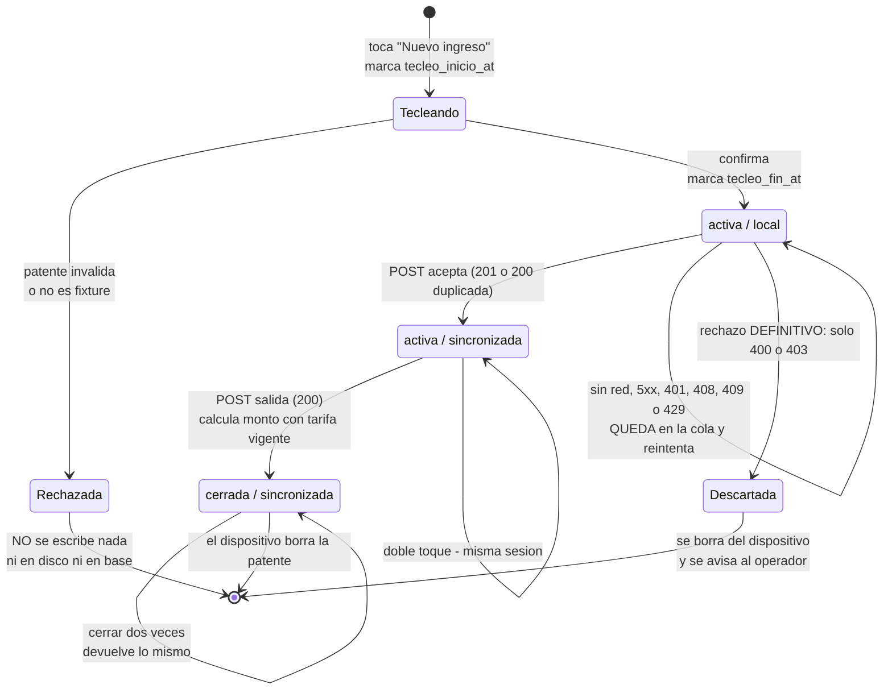
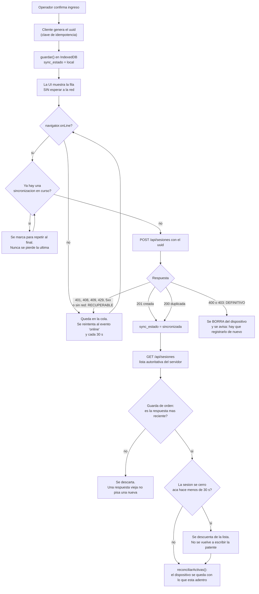
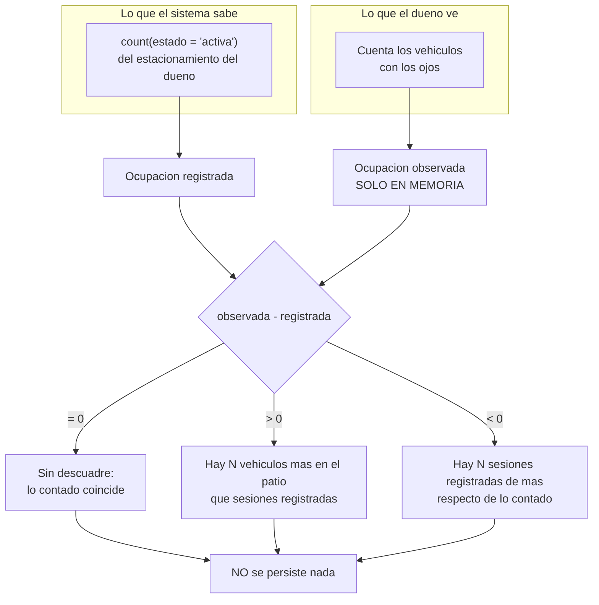

# Flujos

> Tres diagramas derivados del código real, cada transición citada. **Ninguno se
> dibujó desde el docstring**: las guardas y los estados salen de las líneas que
> se citan.
>
> Fecha: 2026-08-13 · Árbol: commit `8c28d9a`

---

## 1. Ciclo de vida de `sesion_vehiculo`

Dos dimensiones que conviene no confundir: **`estado`** dice dónde está el
vehículo, **`sync_estado`** dice dónde está el registro.

**No son ortogonales en la práctica, y el diagrama lo muestra:** de las cuatro
combinaciones posibles solo existen tres. `cerrada / local` **no ocurre nunca**,
porque el cierre pasa siempre por el servidor y el servidor escribe
`syncEstado: "sincronizada"` (`src/app/api/sesiones/[id]/salida/route.ts:115`),
igual que al insertar (`src/app/api/sesiones/route.ts:177`).

### Trazabilidad de cada transición

| Transición | Guarda / efecto | Cita |
|---|---|---|
| `[*] → Tecleando` | marca `tecleo_inicio_at` | `src/app/pantalla-operador.tsx:280` |
| `Tecleando → Rechazada` | patente inválida | `src/lib/patente.ts:53` |
| `Tecleando → Rechazada` | no es fixture y `OPERACION_REAL_HABILITADA=false` | `src/app/pantalla-operador.tsx:310` |
| `Tecleando → activa/local` | marca `tecleo_fin_at`, escribe IndexedDB | `src/app/pantalla-operador.tsx:337` |
| `activa/local → activa/sincronizada` | el servidor acepta; se marca `syncEstado: "sincronizada"` | `src/lib/cola-local.ts:315` |
| `activa/local → Descartada` | **solo** 400 o 403 | `src/lib/cola-local.ts:276` |
| `activa/local → activa/local` | 401, 408, 409, 429, 5xx o sin red: queda en la cola | `src/lib/cola-local.ts:277` |
| `activa/* → cerrada` | calcula monto con tarifa vigente | `src/app/api/sesiones/[id]/salida/route.ts:84` |
| `cerrada → cerrada` | idempotente | `src/app/api/sesiones/[id]/salida/route.ts:79` |
| `cerrada → [*]` | el dispositivo borra la patente | `src/app/pantalla-operador.tsx:360` |

### Lo que el diagrama hace visible

**`Rechazada` no toca disco.** No es un estado de la base: es el camino que
garantiza que una patente real **nunca se recolecta** (hallazgo A-3). Por eso la
flecha sale del flujo antes de `ActivaLocal`.

**No existe `cerrada / local`.** El cierre requiere red por construcción: sin
servidor no hay tarifa vigente y sin tarifa no hay monto. Es la asimetría del
CU-04, y el diagrama la vuelve estructural en vez de anecdótica.

**El índice único parcial actúa entre `Tecleando` y `ActivaSync`**
(`src/db/schema.ts:148`): un segundo ingreso de la misma patente activa responde
`200` con `duplicada: true` en vez de crear una fila.

---

## 2. Outbox offline-first, con resolución servidor-autoritativa

### Trazabilidad

| Elemento | Cita | Por qué existe |
|---|---|---|
| uuid generado por el cliente | `src/app/pantalla-operador.tsx:324` | sin id estable, una reconexión inestable duplica sesiones en cada reintento |
| escribir disco antes que red | `src/app/pantalla-operador.tsx:337` | es lo que hace que el registro no dependa de la señal |
| una sincronización a la vez | `src/app/pantalla-operador.tsx:218` | sin la guarda, cada ingreso re-posteaba la cola entera |
| reintento periódico (30 s) | `src/app/pantalla-operador.tsx:268` | una cola diferida por un 429 se quedaba así hasta que el operador tocara algo |
| **solo** 400/403 borran del dispositivo | `src/lib/cola-local.ts:276` | la regla es **asimétrica a propósito**: se borra solo cuando el servidor afirma que ese dato no puede existir. Tratar todo el 4xx como definitivo era pérdida de datos — un 401 por cookie caducada, o el 429 del propio límite de C-1, vaciaba la cola del operador |
| el aviso al operador lo pinta la pantalla | `src/app/pantalla-operador.tsx:228` | el almacén decide qué se borra; la UI solo informa cuántos |
| guarda de orden por secuencia | `src/app/pantalla-operador.tsx:171` | un `GET` que sale antes del `INSERT` y vuelve corto dejaba la ocupación en 0 con el estacionamiento lleno |
| memoria de cierres recientes (30 s) | `src/app/pantalla-operador.tsx:45` | hallazgo INT-9: una respuesta emitida antes del cierre re-escribía una patente ya borrada |
| `reconciliarActivas()` | `src/lib/cola-local.ts:201` | el dispositivo conserva lo que está adentro y suelta lo demás (M-4) |

### La resolución de conflicto, dicha con precisión

**El servidor es autoritativo sobre qué está adentro; el dispositivo es
autoritativo sobre qué todavía no subió.** La lista en pantalla es la unión de
ambos, deduplicada por `id`, con el servidor pisando al dispositivo
(`src/app/pantalla-operador.tsx:393`).

Esa asimetría es deliberada: el servidor no puede saber de un ingreso que nunca
le llegó, y el dispositivo no puede saber de una salida que registró otro turno.

**Dos excepciones donde el dispositivo gana**, y las dos son correcciones de
hallazgos reales:

1. **Cierres recientes** (`:45`): una respuesta del servidor emitida *antes* de un
   cierre local todavía lista el vehículo. Aplicarla re-escribiría una patente ya
   borrada. Es INT-9.
2. **Sin red** (`:203`): si el `GET` falla, la lista local manda y se marca
   `listaCompleta = false` para decírselo al operador en pantalla.

---

## 3. Descuadre

### Trazabilidad

| Elemento | Cita |
|---|---|
| ocupación registrada | `src/app/dueno/page.tsx:49` |
| ocupación observada, en memoria | `src/app/dueno/descuadre.tsx:26` |
| cálculo de la diferencia | `src/app/dueno/descuadre.tsx:30` |
| los tres mensajes | `src/app/dueno/descuadre.tsx:60` |

### Por qué el flujo termina en "no se persiste nada"

`spec.md` §6 dice que el panel no requiere tabla adicional. Es además lo correcto
en minimización: el descuadre es **una comparación puntual, no un registro que
conservar**.

Y hay una razón más fuerte, que conviene dejar escrita: un descuadre persistido
es una acusación con historia sobre una persona identificable —el operador de
turno—. El panel **hace visible** la diferencia y **no la impide**. Registrar la
sospecha como un hecho sería inventar evidencia.

Las maquetas `1d` y `1n` proponen exactamente eso (*"Descuadre: 7"* como KPI,
*"unos $12.000 que el sistema no vio"*). **Rechazado** en `MER.md` §5.

### Lo que el flujo NO cubre

La ocupación registrada se compara contra un conteo **del momento**. No hay
ventana temporal, ni histórico, ni tendencia. Un descuadre sistemático de 1
vehículo y uno esporádico de 1 se ven idénticos.

Resolverlo exige persistir el conteo, que es justo lo que `spec.md` §6 prohíbe.
**Es una limitación consciente del diseño, no una omisión**, y cambiarla requiere
enmendar la spec, no agregar una tabla.
