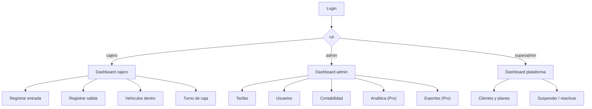

# ParkControl · Diseño — mapa de pantallas y reglas de interfaz

> **El diseño declarado es la base**, y esto lo traduce a algo exigible: qué
> pantalla existe, para qué rol, con qué plan, y **qué estados tiene que saber
> mostrar**. Una pantalla sin sus estados de carga, error, vacío y sin conexión
> no está terminada, aunque se vea bien con datos de prueba.

---

## 1. Inventario — declarado contra contado

La descripción afirma **27 pantallas** y **nombra 13**. La diferencia no es un
error: es que **un número en un documento no es un inventario**.

**Primera tarea, antes de tocar el diseño:** contarlas de verdad y llenar la
columna «archivo real».

| # | Pantalla | Rol | Plan | Archivo declarado | Archivo real |
|---|---|---|---|---|---|
| 1 | Login | todos | — | *(no nombrado)* | **A CONTAR** |
| 2 | Dashboard cajero | cajero | ambos | `cajero_dashboard.dart` | **A CONTAR** |
| 3 | Registrar entrada | cajero | ambos | `registrar_entrada_screen.dart` | **A CONTAR** |
| 4 | Registrar salida | cajero | ambos | `registrar_salida_screen.dart` | **A CONTAR** |
| 5 | Vehículos dentro | cajero | ambos | `vehiculos_dentro_screen.dart` | **A CONTAR** |
| 6 | Turno de caja | cajero | ambos | `turno_caja_screen.dart` | **A CONTAR** |
| 7 | Dashboard admin | admin | ambos | `admin_dashboard.dart` | **A CONTAR** |
| 8 | Tarifas | admin | ambos | `tarifas_screen.dart` | **A CONTAR** |
| 9 | Usuarios | admin | ambos, con límite | `users_screen.dart` | **A CONTAR** |
| 10 | Contabilidad | admin | **Pro** (Lite: básico) | `contabilidad_screen.dart` | **A CONTAR** |
| 11 | Analítica y gráficos | admin | **Pro** | `analitica_pro_screen.dart` | **A CONTAR** |
| 12 | Dashboard superadmin | superadmin | — | `superadmin_dashboard.dart` | **A CONTAR** |
| 13 | Clientes y planes | superadmin | — | `clientes_screen.dart` | **A CONTAR** |
| 14–27 | **sin nombrar** | ? | ? | — | **A CONTAR** |

**Lo que hay que reportar al contarlas, y no solo el número:** cuántas están
enrutadas de verdad, cuántas son huérfanas —existen y nadie navega a ellas— y
cuántas repiten una capacidad que ya vive en otra. Una pantalla huérfana es
superficie que nadie prueba y que igual puede alcanzar datos.

---

## 2. Navegación por rol

**Regla que el mapa tiene que respetar y casi nunca se verifica:** que un rol no
tenga un enlace **no es** que no tenga el permiso. Navegar a mano a la ruta de
otro rol tiene que dar el mismo resultado que no verla. Se prueba pidiendo la
ruta directamente, no mirando el menú.

---

## 3. Los estados que toda pantalla debe tener

La mayoría de los defectos de interfaz no están en el caso feliz. Cada pantalla
que lee datos necesita **cinco**:

| Estado | Qué se ve | Por qué se olvida |
|---|---|---|
| **Cargando** | esqueleto o indicador, sin saltos de layout | en desarrollo la base responde en 5 ms |
| **Vacío** | qué significa y qué hacer — no una tabla en blanco | nunca se prueba con cero filas |
| **Error** | qué pasó y qué puede hacer el usuario, **sin detalles técnicos** | se prueba con el servidor arriba |
| **Sin conexión** | contenido de primer nivel, no un ícono: badge + **conteo** | se prueba con wifi |
| **Parcial** | *«esta lista puede estar incompleta»* cuando el servidor no respondió | ni se considera |

**El estado sin conexión es el que define a este producto.** El mensaje promete
continuidad, no solo persistencia:

> **Sin conexión** · 3 registros esperando red
> *Se guardaron en este equipo. Suben solos al reconectar; podés seguir
> registrando.*

---

## 4. La pantalla que decide la adopción: registrar entrada

Es la que se usa cien veces por turno. Todo lo demás puede ser aceptable; ésta
tiene que ser rápida.

| Requisito | Por qué |
|---|---|
| **Foco automático en el campo de patente** al abrir | un toque menos, cien veces por turno |
| **Teclado adecuado** al formato de patente | menos cambios de teclado, menos errores |
| **Normalización visible**: *«se normaliza sola, sin guiones ni espacios»* | el cajero no tiene que pensar en el formato |
| **Guarda de reentrancia en Confirmar** | el doble toque **duplica la entrada**. Es un defecto real, no teórico |
| **Confirmación inmediata, sin esperar al servidor** | es lo que hace que la app funcione sin red |
| **Los dos instantes de tecleo** se marcan acá | sin ellos, la promesa de velocidad no se puede medir nunca más |

**Y una que se olvida siempre:** qué pasa si el cajero **se equivoca**. Si no hay
forma de corregir una patente recién tecleada, se corrige por SQL — el camino
menos auditable de todos (`FLUJOS.md` §6).

---

## 5. Reglas de sistema de diseño

1. **Tokens, no literales.** Todo color, radio, sombra y tipografía sale de una
   definición única. Verificable: cero literales de color en los componentes.
2. **Cero recursos de terceros en tiempo de ejecución.** Fuentes e íconos
   empaquetados, nunca por CDN. Dos razones medibles: la política de seguridad de
   contenido, y que **cada carga desde un tercero es una petición del dispositivo
   del cajero con su IP** — en un producto cuyo argumento es que trata pocos datos.
3. **Ninguna pantalla muestra un dato inventado.** Ni un promedio de ejemplo, ni
   una cifra heredada de la maqueta. Si un número todavía no se puede calcular,
   **va vacío con su motivo**, y la prueba **falla si alguien publica un número
   ahí**.
4. **Densidad por rol.** El cajero opera de pie, con una mano, a veces con
   guantes: objetivos táctiles grandes y pocas decisiones por pantalla. El admin
   lee sentado: ahí sí caben tablas densas.
5. **Accesibilidad mínima real:** foco visible, etiquetas en los controles,
   contraste suficiente. Se verifica en el árbol de accesibilidad, no a ojo.

---

## 6. Cómo se ve una capacidad que el plan no incluye

Es una decisión de diseño con consecuencia comercial, y hay que tomarla explícita:

| Opción | Efecto |
|---|---|
| **Ocultarla** | el usuario Lite no sabe que existe. No hay ruta de venta |
| **Mostrarla deshabilitada, con el motivo** | el usuario ve qué gana al mejorar el plan. **Recomendada** |
| Mostrarla y fallar al usar | la peor: promete y frustra |

**Sea cual sea, el servidor decide.** La interfaz solo comunica: una capacidad
Pro pedida con plan Lite **pegándole directo a la API** tiene que responder 403
nombrando la capacidad, aunque el botón no exista en ninguna pantalla.

---

## 7. Lo que este documento no puede resolver

Cuál de las 27 pantallas está construida, cuál está enrutada y cuál quedó
huérfana **no se sabe desde acá**. La columna «archivo real» de §1 es el
entregable que convierte este mapa en un inventario — y hasta que se llene, esto
es el diseño declarado, no el producto.
