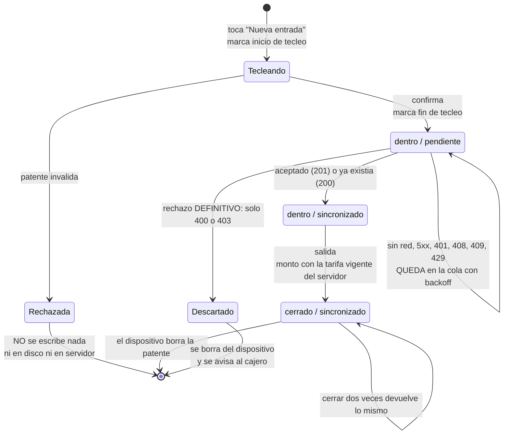
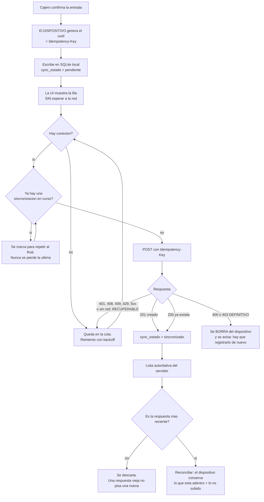
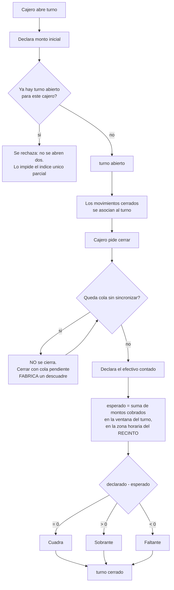
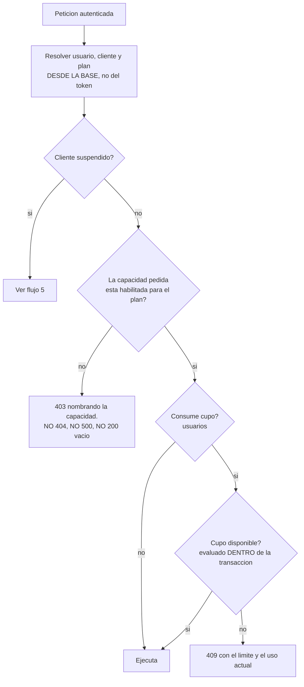
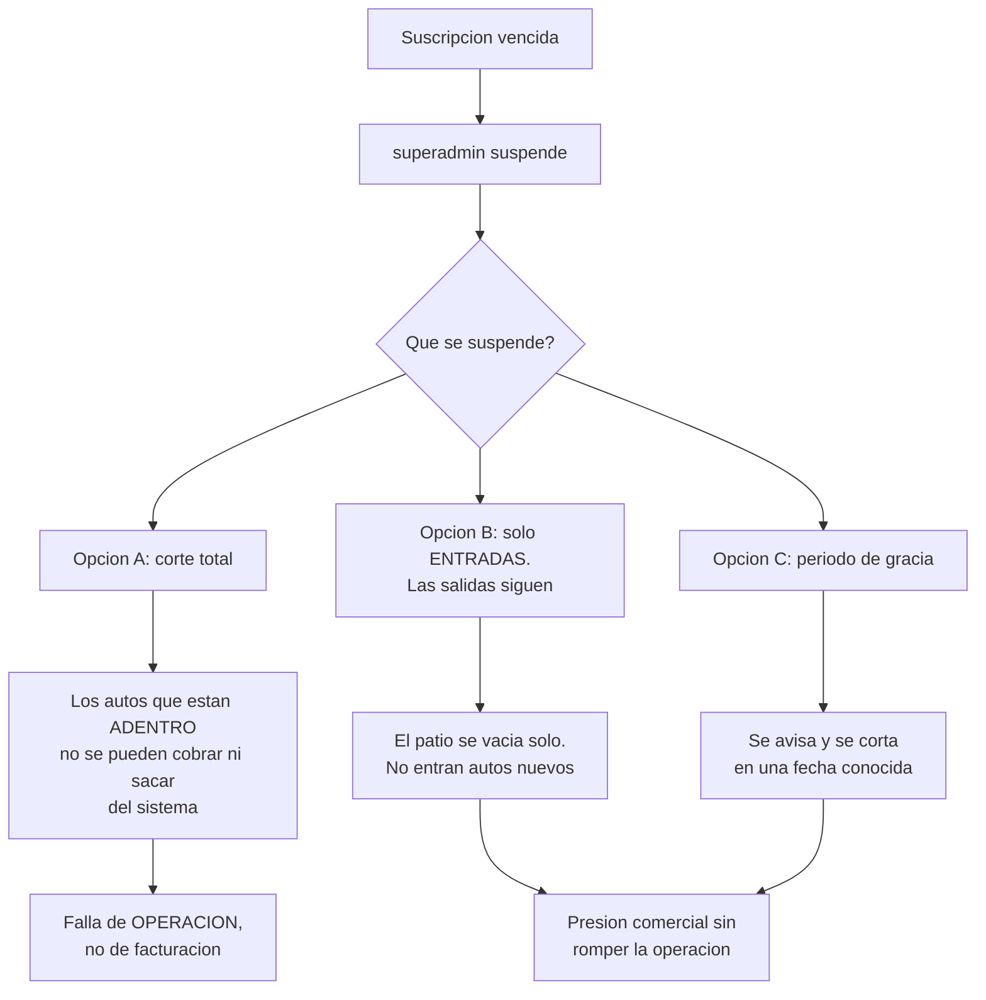

# ParkControl · Flujos

> Cinco diagramas. Cada guarda y cada transición es una afirmación sobre el
> comportamiento: si el árbol no la ejecuta, **el diagrama está mal y se corrige
> el diagrama**, no el código a la fuerza.

---

## 1. Ciclo de vida de un movimiento

Dos dimensiones que conviene no confundir: **`estado`** dice dónde está el
vehículo; **`sync_estado`** dice dónde está el registro.

**Tres cosas que este diagrama hace visibles:**

1. **`Rechazada` no toca disco.** No es un estado de la base: es el camino que
   garantiza que una patente inválida —o real, si hay barrera de piloto— **nunca
   se recolecta**. Rechazar antes de persistir es la diferencia entre no tratar
   el dato y tratarlo mal.
2. **¿Existe `cerrado / pendiente`?** Depende de la decisión abierta de CU-05. Si
   la salida funciona sin red, ese estado existe y **el monto mostrado puede ser
   desmentido por el servidor**. Dibujalo como sea, pero decidilo.
3. **El único rechazo definitivo es 400/403.** Todo lo demás vuelve a la cola.

---

## 2. Outbox, con resolución servidor-autoritativa

### La resolución de conflicto, dicha con precisión

**El servidor es autoritativo sobre qué está adentro; el dispositivo es
autoritativo sobre qué todavía no subió.** La lista en pantalla es la unión de
ambos, deduplicada por `id`, con el servidor pisando.

La asimetría es deliberada: el servidor no puede saber de una entrada que nunca
le llegó, y el dispositivo no puede saber de una salida que registró otro turno.

**Dos excepciones donde el dispositivo tiene que ganar**, y las dos son defectos
reales si faltan:

1. **Cierres recientes.** Una respuesta del servidor emitida *antes* de un cierre
   local todavía lista el vehículo. Aplicarla **re-escribiría una patente ya
   borrada**. Hace falta una memoria corta de cierres.
2. **Sin red.** Si la lectura falla, manda la lista local **y se marca en
   pantalla que está incompleta**.

---

## 3. Turno de caja y arqueo

**El paso que casi nunca está y es el que sostiene la honestidad del arqueo:** el
rombo *«¿queda cola sin sincronizar?»*. Si el dispositivo tiene entradas o
salidas sin subir, el esperado del servidor está **incompleto**, y la diferencia
que se calcule no mide al cajero: mide a la red.

Y el cálculo del esperado se hace en la **zona horaria del recinto**. Un corte
tomado en la zona del servidor produce descuadres fantasma dos veces al día.

---

## 4. La decisión de plan — dónde vive el modelo comercial

**Dos propiedades que lo vuelven real y no decorativo:**

- El chequeo vive en **un envoltorio por el que pasan todas las rutas**, y se
  verifica **por exclusión** —un barrido del árbol que falla si alguna ruta se
  registra por fuera—. Una lista blanca de rutas protegidas deja agujeros por
  construcción: la ruta que alguien agregue mañana nace sin control.
- El cupo se evalúa **dentro de la transacción** que crea el usuario. Contar
  antes y crear después deja pasar dos altas simultáneas.

---

## 5. Suspensión por impago — el flujo que falta decidir

**Está sin decidir, y es una decisión de producto, no de implementación.** La
opción A es la que sale por default cuando nadie la piensa, y es la única que
convierte un problema de cobranza en un auto que no puede salir del patio.

---

## 6. Lo que estos flujos NO cubren

Se dice, en vez de omitirse, porque un documento que calla se lee como completo:

- **No hay flujo de conciliación entre turnos** que se solapan en el mismo
  recinto: dos cajeros a la vez, o un relevo con vehículos adentro.
- **No hay flujo de corrección** de un movimiento mal registrado —patente
  tecleada mal, salida cobrada de menos—. En operación real eso pasa todos los
  días, y sin flujo se resuelve por SQL a mano, que es el camino menos auditable.
- **No hay flujo de baja de usuario**, y sin él la auditoría por cajero es una
  promesa que nadie puede hacer cumplir.
- **No hay flujo de retención**: qué borra las patentes vencido el plazo, quién
  lo corre y con qué evidencia de que corrió.
