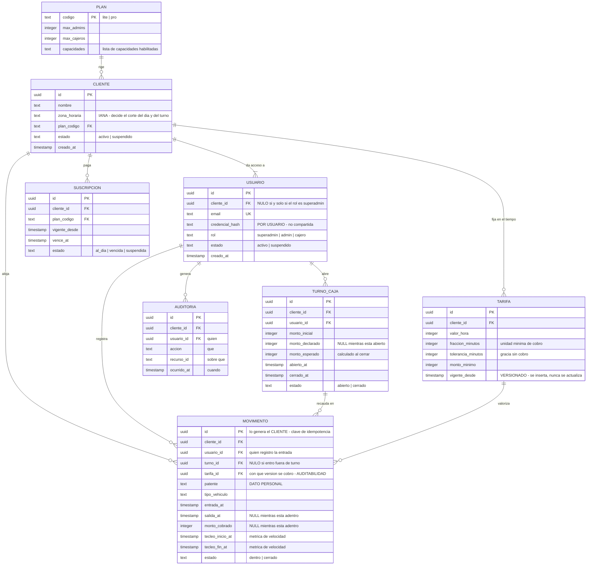
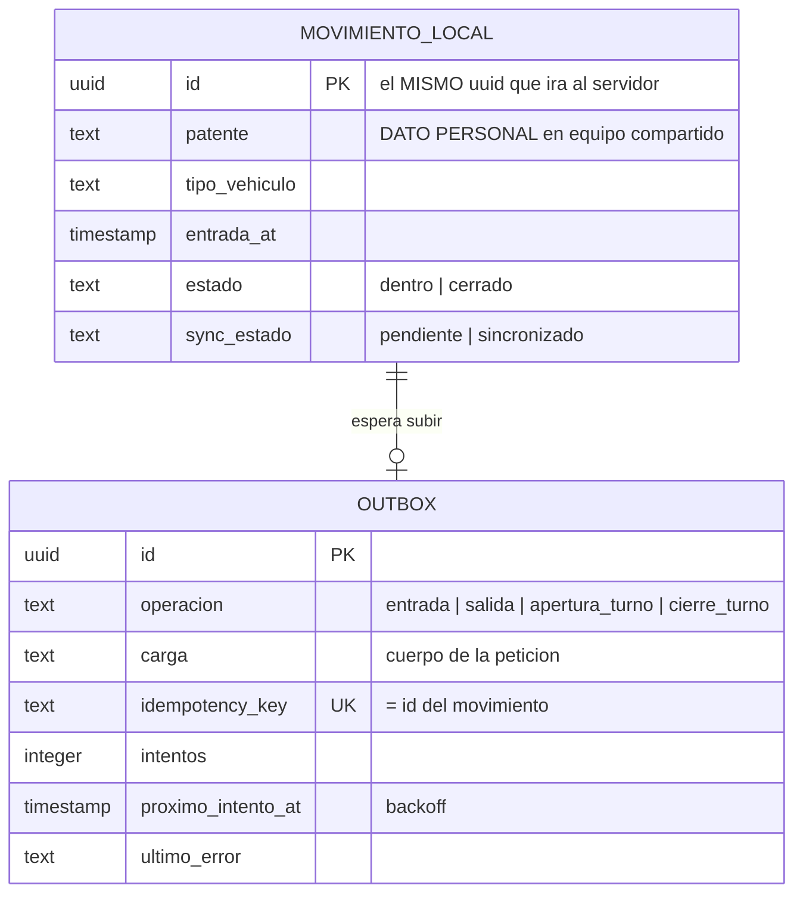

# ParkControl · MER — modelo entidad-relación

> **Derivado de la descripción declarada, no diseñado desde cero.** Cada entidad
> lleva su procedencia. Lo que no sale de la descripción va como **INFERIDO** y
> hay que confirmarlo contra el esquema real antes de darlo por cierto.
>
> **Son dos bases distintas y el diagrama las separa** (§2 y §3): la del servidor
> —fuente de verdad— y la del dispositivo —espejo parcial más cola de salida—.
> Confundirlas es el error más caro que se puede cometer acá.

---

## 1. El gate de este modelo

Antes de que una entidad o un campo entre, tiene que responder **sí** a una:

1. **¿Sirve para operar el flujo** de entrada, salida, cobro o turno?
2. **¿Sirve para que el administrador vea lo que hoy no puede verificar**, y por
   eso pague?
3. **¿Lo exige una obligación legal o comercial explícita** — retención, licitud,
   límites del plan, facturación de la suscripción?

Lo que no pasa se lista en §5 con su razón. **No entra al diagrama.** «Por si
sirve» no es una razón: es el mecanismo por el que un modelo se llena de campos
que después nadie puede borrar.

---

## 2. Servidor — el modelo autoritativo

### Procedencia de cada entidad

| Entidad | Procedencia | Gate |
|---|---|---|
| `CLIENTE` | **DECLARADO** — multi-inquilino con clientes/estacionamientos | operar + comercial |
| `PLAN` | **DECLARADO** — Lite y Pro con límites y capacidades | comercial |
| `USUARIO` | **DECLARADO** — tres roles, límites por plan | operar |
| `TARIFA` | **DECLARADO** — por minuto/hora, tolerancia, fraccionamiento | operar |
| `MOVIMIENTO` | **DECLARADO** — entradas y salidas | operar + visibilidad |
| `TURNO_CAJA` | **DECLARADO** — apertura y cierre de turnos | operar + auditoría |
| `SUSCRIPCION` | **DECLARADO** — planes contratados, vencimientos, cobros | comercial |
| `AUDITORIA` | **DECLARADO** — auditorías de movimientos y alertas | obligación |
| `movimiento.tarifa_id` | **INFERIDO** | Sin él, un admin que cambia la tarifa **no puede reconstruir** un monto ya cobrado. Y la visibilidad *es* el producto |
| `movimiento.tecleo_*` | **INFERIDO** | Sin dos instantes por movimiento, la promesa *«más rápido que el cuaderno»* **no se puede medir nunca más**: el dato no se reconstruye después |
| `usuario.credencial_hash` | **INFERIDO** | Ver §4: sin credencial **por usuario**, suspender a alguien no revoca nada |

---

## 3. Dispositivo — el espejo y la cola

**No es el mismo modelo recortado: es otro modelo.** Su trabajo es que la
operación no se detenga sin red, y **soltar todo lo que ya no necesita**.

**Tres reglas que hacen que este modelo sea seguro y no solo funcional:**

1. **El `uuid` lo genera el dispositivo**, antes de escribir. Es la clave de
   idempotencia y lo que impide que una reconexión inestable duplique filas.
2. **El dispositivo conserva solo lo que está adentro más lo que no subió.** Un
   movimiento cerrado y sincronizado **se borra**, con su patente. En un equipo
   que rota entre turnos, cada fila que sobra es dato personal del turno anterior.
3. **Al cerrar sesión se vacía todo** — y solo **después** de que el servidor
   confirme, nunca antes.

---

## 4. La relación que decide si el producto escala

**`USUARIO` necesita credencial propia, no compartida.** Es INFERIDO porque la
descripción no lo dice, y es la pregunta que hay que responder antes que
cualquier otra de identidad:

- Si la credencial es **por cliente** o compartida entre cajeros, entonces
  `usuario.estado = suspendido` **da la apariencia de revocación sin la
  revocación**: la misma persona entra con otro email y la misma clave.
- Y la auditoría por usuario (CU-14) pierde sentido: si dos personas comparten
  credencial, atribuir un descuadre a un `usuario_id` es atribuirlo a quien tocó
  teclear, no a quien lo hizo.

**Auditar y suspender son promesas que dependen de esto.** No se construyen
antes.

---

## 5. Descartado por el gate — con su razón

Se lista para que la próxima persona no lo vuelva a proponer sin leer por qué no
está.

| Candidato | Gate | Razón |
|---|---|---|
| **`VEHICULO` como entidad** | **no pasa** | Construye un **historial de movimientos por patente**, o sea el perfil de desplazamientos de una persona identificable. Ninguna capacidad del producto lo necesita: la patente es un **atributo del movimiento** |
| **`CLIENTE_FRECUENTE` / abonados** | **no pasa hoy** | No está en la descripción. Si entra, entra con su propia base de licitud: es un padrón de personas |
| **Fotos o LPR** | **no pasa** | No está declarado, y agrega dato biométrico-adyacente y almacenamiento con retención propia |
| **Geolocalización del cajero** | **no pasa** | Ninguna capacidad la pide. Es vigilancia laboral encubierta si entra «para auditar» |
| **`DESCUADRE` como entidad histórica** | **decisión abierta** | Persistir la diferencia de arqueo es guardar una acusación con historia sobre una persona. Con dinero de por medio es defendible — **pero exige licitud, retención y que la persona lo sepa**. No entra por default |
| **Jerarquía sobre `CLIENTE`** (grupo, empresa, sucursales) | **no pasa hoy** | Multi-inquilino ≠ multisitio. Si un cliente puede tener varios recintos, **todas** las cláusulas de aislamiento cambian de forma. Es una decisión de producto, no un campo |

---

## 6. Dato personal — lo que este modelo obliga a resolver

| Dato | ¿Personal? | Dónde vive | Qué falta |
|---|---|---|---|
| `movimiento.patente` | **sí** | servidor **y dispositivo** | plazo de retención y base de licitud |
| `usuario.email` | **sí** | servidor | plazo de retención — casi siempre olvidado |
| `auditoria.*` | **sí, por asociación** | servidor | es un registro de conducta de una persona identificable |
| exportes PDF / Excel / CSV / correo | **sí, y fuera de control** | **fuera del sistema** | ninguna retención los alcanza una vez emitidos |
| nombre, zona horaria, capacidad del cliente | no, por sí mismos | servidor | — |

**La fila que más se subestima es la última con dato personal: los exportes.**
Todo lo que sale por ahí deja de estar cubierto por cualquier política que se
escriba después. Mínimo exigible: que quede registro de **quién exportó qué y
cuándo**, y que el correo programado tenga destinatario verificado y se pueda
cortar.
